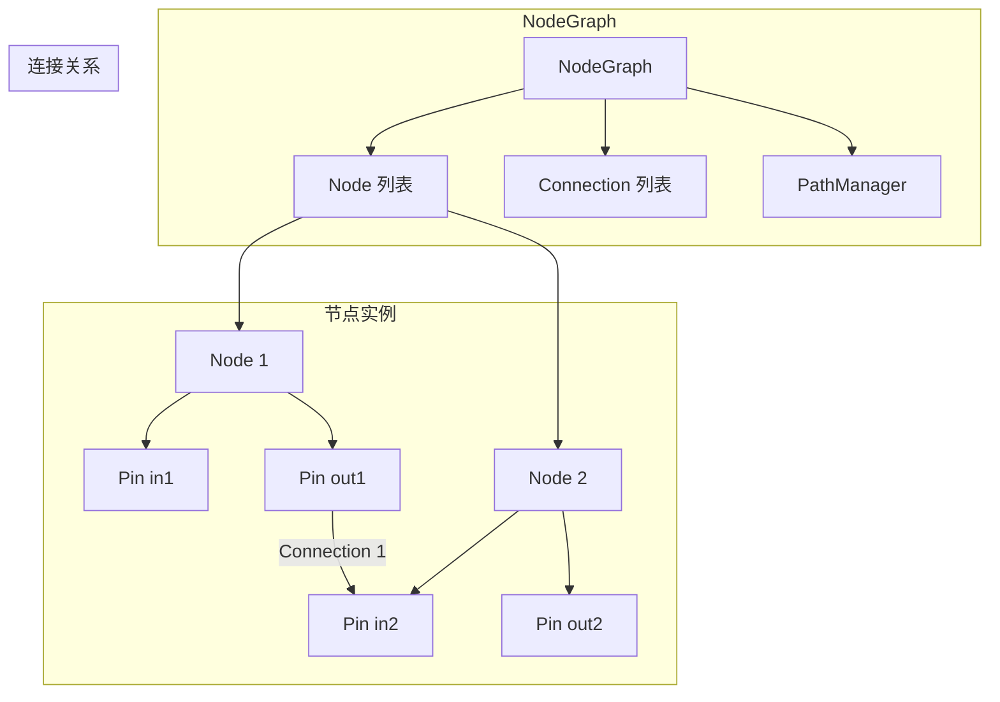
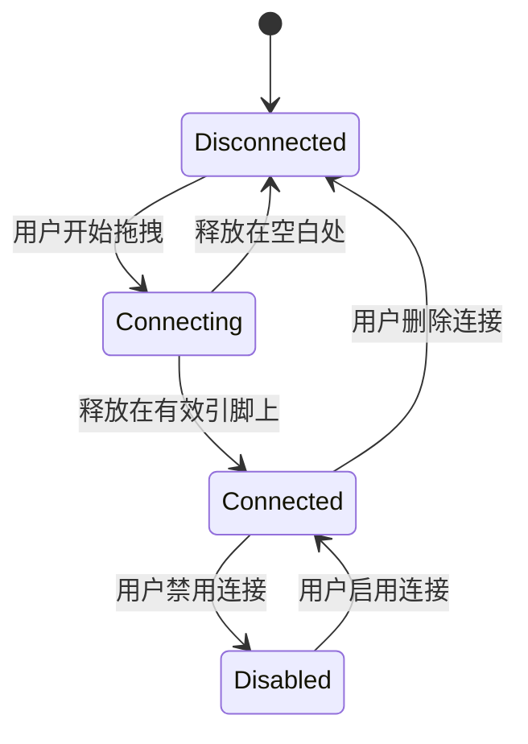
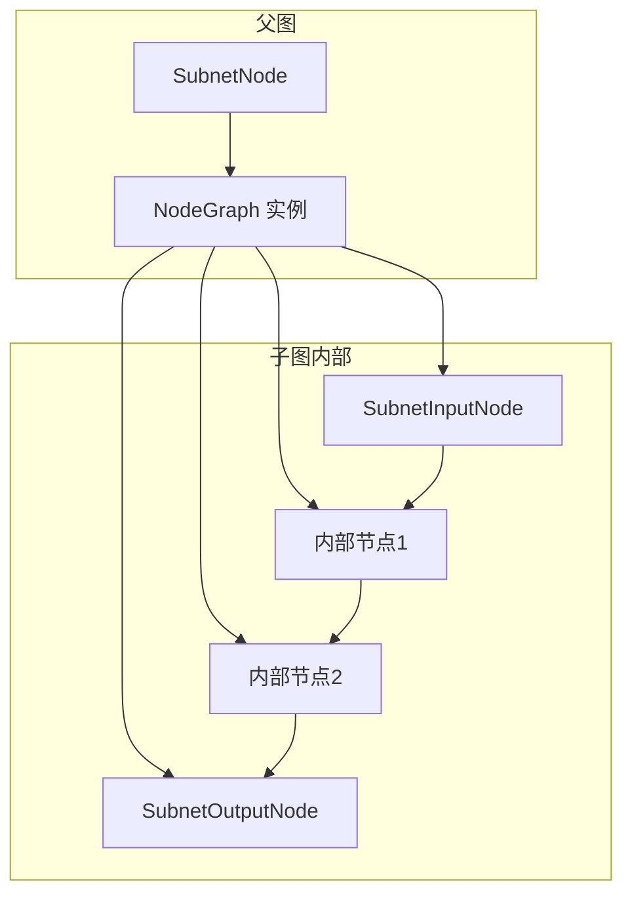
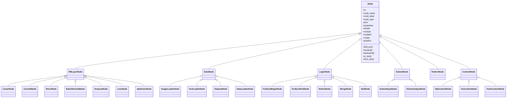
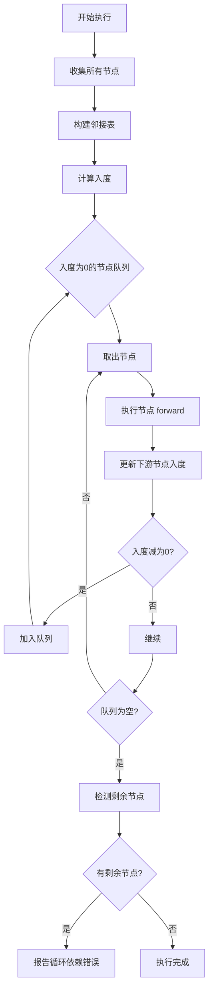

# 03 — 核心节点系统设计文档

---

## 1. 概述

核心节点系统是 PNNE 的基石，负责定义和调度所有计算单元。本系统采用面向对象设计，以 `Node` 为基类，`Pin` 为数据接口，`Connection` 为数据通道，`NodeGraph` 为容器，共同构成一个可扩展、可序列化、可执行的数据流图。

### 1.1 设计目标

| 目标 | 说明 |
|------|------|
| **抽象性** | 统一的计算单元接口，隐藏具体实现 |
| **可扩展性** | 通过继承轻松添加新节点类型 |
| **类型安全** | 输入/输出引脚类型检查，防止错误连接 |
| **序列化** | 完整状态可保存为 JSON，支持版本迁移 |
| **执行调度** | 基于拓扑排序的依赖解析，支持循环迭代 |

### 1.2 核心概念关系



---

## 2. Node 基类设计

### 2.1 类定义

```python
class Node:
    """
    所有节点的基类。
    
    属性：
    - id: 全局唯一标识符（UUID）
    - node_name: 节点名称（路径中使用的标识）
    - node_label: 显示名称（可自定义）
    - node_type: 节点类型枚举
    - parent: 父节点（Subnet 或 Context）
    - children: 子节点列表（用于 Subnet）
    - pins: Dict[str, Pin] 输入/输出引脚字典
    - properties: Dict[str, Property] 可编辑参数字典
    - details: Dict[str, Any] 向下游传递的元数据
    - module: Optional[nn.Module] 对应的 PyTorch 模块
    - enabled: bool 是否启用
    - visible: bool 是否可见
    - position: (x, y) 在画布上的坐标
    """
```

### 2.2 核心方法

| 方法 | 描述 | 返回值 |
|------|------|--------|
| `add_pin(name, direction, data_type)` | 添加引脚 | Pin |
| `remove_pin(name)` | 移除引脚 | None |
| `forward(inputs)` | 前向计算 | Dict[str, Any] |
| `backward(gradients)` | 反向传播（可选） | Dict[str, Any] |
| `get_path()` | 获取节点在路径树中的绝对路径 | str |
| `to_dict()` | 序列化为字典 | Dict |
| `from_dict(data)` | 从字典恢复节点 | Node |

### 2.3 生命周期钩子

```python
def on_create(self):
    """节点创建后被调用，用于初始化资源"""

def on_destroy(self):
    """节点销毁前被调用，用于清理资源"""

def on_property_changed(self, name, old_value, new_value):
    """属性改变时触发，可用于更新内部状态"""

def on_connection_added(self, connection):
    """连接建立时触发"""

def on_connection_removed(self, connection):
    """连接断开时触发"""
```

---

## 3. Pin 类设计

### 3.1 引脚类型

| 类型 | 说明 | 示例 |
|------|------|------|
| TENSOR | PyTorch 张量 | torch.Tensor |
| INT | 整数 | 42 |
| FLOAT | 浮点数 | 3.14 |
| STRING | 字符串 | "hello" |
| BOOL | 布尔值 | True |
| ANY | 任意类型（类型检查跳过） | any |

### 3.2 类定义

```python
class Pin:
    """
    节点的输入/输出接口。
    
    属性：
    - id: 唯一标识符
    - name: 引脚名称（如 "input_1", "output_2"）
    - direction: INPUT 或 OUTPUT
    - data_type: 数据类型枚举
    - default_val: 默认值（当没有连接时使用）
    - connections: List[Connection] 已建立的连接列表
    - owner_node: Node 所属节点
    - cached_data: 最后一次计算缓存的数据
    - shape_hint: 形状提示（仅对 TENSOR 有效）
    """
```

### 3.3 引脚形状推导

引脚可以自动推导张量形状，通过分析上游节点的输出形状。形状推导规则：

1. **直接传递**: 如果上游引脚已有形状，直接使用
2. **表达式计算**: 通过形状表达式（如 `[batch, channels, height, width]`）计算
3. **动态推断**: 在运行时根据实际数据推断

```mermaid
graph LR
    A[上游节点] --> B[输出引脚 shape: [32,3,224,224]]
    B --> C[连接线]
    C --> D[下游节点输入引脚]
    D --> E[形状推导器]
    E --> F[更新 shape_hint]
```

---

## 4. Connection 类设计

### 4.1 类定义

```python
class Connection:
    """
    两个引脚之间的数据通道。
    
    属性：
    - id: 唯一标识符
    - source_node: 源节点
    - source_pin: 源引脚
    - target_node: 目标节点
    - target_pin: 目标引脚
    - enabled: 是否启用（禁用时数据不流动）
    - data_type: 数据类型（自动从源引脚继承）
    - metadata: 连接元数据（如传输次数、带宽统计）
    """
```

### 4.2 连接规则

| 规则 | 说明 |
|------|------|
| 类型匹配 | 源引脚和目标引脚的数据类型必须兼容（TENSOR→TENSOR, INT→FLOAT 等） |
| 方向正确 | 源必须是 OUTPUT，目标必须是 INPUT |
| 非自连接 | 不允许同一个节点的引脚之间连接 |
| 唯一性 | 同一个目标引脚只能有一个激活的连接 |
| 无循环 | 连接不能形成直接循环（间接循环由拓扑排序检测） |

### 4.3 连接状态机



---

## 5. NodeGraph 管理器

### 5.1 类定义

```python
class NodeGraph:
    """
    节点图的容器和管理器。
    
    属性：
    - name: 图名称
    - nodes: Dict[str, Node] 节点字典（key 为 node_id）
    - connections: Dict[str, Connection] 连接字典
    - contexts: Dict[str, ContextNode] 上下文根节点
    - path_manager: PathManager 路径管理器
    - dirty: bool 标记图是否被修改（用于保存提示）
    """
```

### 5.2 核心方法

| 方法 | 描述 |
|------|------|
| `add_node(node)` | 添加节点，自动分配唯一 ID |
| `remove_node(node_id)` | 移除节点及其所有连接 |
| `connect(source_node_id, source_pin_name, target_node_id, target_pin_name)` | 建立连接 |
| `disconnect(connection_id)` | 断开连接 |
| `get_node_by_path(path)` | 通过路径查找节点 |
| `topological_sort()` | 拓扑排序，返回可执行顺序 |
| `execute(inputs)` | 执行整个图 |
| `to_dict()` | 序列化整个图 |
| `from_dict(data)` | 反序列化整个图 |

### 5.3 子图支持

NodeGraph 支持嵌套子图（Subnet）。子图本身也是一个 NodeGraph 实例，通过 SubnetNode 与父图交互。



---

## 6. 节点继承体系

### 6.1 类层次结构



### 6.2 节点类型详解

#### 6.2.1 NNLayerNode

神经网络层节点，封装 PyTorch 的 `nn.Module`。

**特性：**
- 自动创建对应的 `nn.Module` 实例
- 参数面板实时同步模块参数
- 支持 GPU/CPU 设备迁移
- 前向传播调用 `module.forward()`

**示例：LinearNode**

```python
class LinearNode(NNLayerNode):
    def __init__(self):
        super().__init__()
        self.add_property("in_features", 512, PropertyType.INT)
        self.add_property("out_features", 256, PropertyType.INT)
        self.add_property("bias", True, PropertyType.BOOL)
        
    def create_module(self):
        return nn.Linear(
            self.properties["in_features"].value,
            self.properties["out_features"].value,
            self.properties["bias"].value
        )
```

#### 6.2.2 DataNode

数据加载和处理节点。

**特性：**
- 支持多种数据格式（图像、文本、CSV、OBJ）
- 可配置数据增强管道
- 自动批处理和 shuffle
- 内存映射和缓存支持

#### 6.2.3 LogicNode

逻辑控制节点，用于控制流。

**ForEachBeginNode / ForEachEndNode：**
- 实现循环迭代，支持嵌套
- 可配置迭代次数或迭代数据集
- 内部节点在每次迭代中重复执行

**SwitchNode：**
- 条件分支，根据布尔值选择输出路径
- 支持多路分支（类似 switch-case）

**MergeNode：**
- 合并多个输入流，支持不同合并策略（相加、拼接、平均）

#### 6.2.4 SubnetNode

子网容器节点。

**特性：**
- 双击进入内部编辑
- 4个标准输入接口（可配置）
- 可配置输出接口数量
- 内部节点可访问父图变量（通过 Detail）

#### 6.2.5 PythonNode

Python 脚本节点。

**特性：**
- 内嵌代码编辑器，语法高亮
- 支持导入项目模块
- 安全沙盒执行（可配置）
- 调试器集成（断点、单步执行）

#### 6.2.6 ContextNode

上下文根节点，定义不同的路径空间。

| 上下文 | 路径 | 用途 |
|--------|------|------|
| ObjContextNode | `/obj/` | 模型构建空间，可创建 NN 层节点 |
| VisContextNode | `/vis/` | 可视化控制空间，配置监控 |
| TrainContextNode | `/train/` | 训练控制空间，配置数据集、优化器 |

---

## 7. 节点执行流程

### 7.1 拓扑排序算法



### 7.2 执行上下文

每个节点在执行时可以获得以下上下文信息：

| 上下文变量 | 类型 | 说明 |
|------------|------|------|
| `inputs` | Dict[str, Any] | 输入引脚的数据字典 |
| `details` | Dict[str, Any] | 上游节点传递的元数据 |
| `global_context` | Dict[str, Any] | 全局上下文（如 epoch、batch 索引） |
| `device` | torch.device | 当前计算设备（GPU/CPU） |

### 7.3 错误处理

节点执行可能遇到多种错误，系统提供分级处理：

1. **节点级错误**：节点内部异常，标记节点为错误状态，不影响其他节点执行
2. **图级错误**：拓扑排序失败、循环依赖等，停止整个图执行
3. **资源错误**：内存不足、GPU 显存溢出，尝试回收资源后重试

错误状态可视化：
- 红色边框：节点执行错误
- 黄色边框：节点警告（如类型不匹配）
- 灰色边框：节点禁用

---

## 8. 数据流和依赖管理

### 8.1 数据流模型


### 8.2 依赖类型

| 依赖类型 | 说明 | 处理方式 |
|----------|------|----------|
| **数据依赖** | 节点需要上游节点的输出数据 | 通过 Connection 显式声明 |
| **控制依赖** | 节点执行顺序受逻辑节点控制 | 通过 ForEach/Switch 节点隐式管理 |
| **资源依赖** | 节点共享 GPU 内存、文件句柄等 | 通过设备管理器协调 |
| **时间依赖** | 节点需要在特定时间点执行 | 通过定时器节点实现 |

### 8.3 依赖解析算法

```python
def resolve_dependencies(graph):
    """解析图中所有依赖关系，返回执行计划"""
    # 1. 收集所有节点
    # 2. 识别数据依赖（通过 Connection）
    # 3. 识别控制依赖（通过 LogicNode 分析）
    # 4. 识别资源依赖（通过节点声明的资源需求）
    # 5. 生成依赖图
    # 6. 拓扑排序（考虑控制依赖特殊处理）
    # 7. 返回排序后的节点列表
```

---

## 9. 扩展性设计

### 9.1 自定义节点开发

创建新节点只需继承 `Node` 基类并注册：

```python
from core.base.node import Node
from core.base.node_registry import register_node

@register_node("custom", "MyCustomNode")
class MyCustomNode(Node):
    def __init__(self):
        super().__init__()
        self.node_type = "custom"
        self.add_pin("input", PinDirection.INPUT, DataType.TENSOR)
        self.add_pin("output", PinDirection.OUTPUT, DataType.TENSOR)
        self.add_property("threshold", 0.5, PropertyType.FLOAT)
        
    def forward(self, inputs):
        data = inputs["input"]
        threshold = self.properties["threshold"].value
        output = (data > threshold).float()
        return {"output": output}
```

### 9.2 节点模板系统

常用节点组合可保存为模板，快速复用：

```json
{
  "template_name": "ResNetBlock",
  "nodes": [...],
  "connections": [...],
  "inputs": ["x"],
  "outputs": ["out"],
  "description": "标准的 ResNet 残差块"
}
```

### 9.3 动态节点加载

支持运行时加载外部 Python 文件中的节点类，无需重启应用。

---

## 10. 性能优化

### 10.1 节点执行缓存

- **结果缓存**：节点输出缓存，当输入未改变时直接返回缓存结果
- **形状缓存**：张量形状推导结果缓存，避免重复计算
- **连接缓存**：连接状态缓存，快速判断数据是否流动

### 10.2 批量执行优化

对于可并行的节点，系统自动识别并批量执行：

```python
# 自动识别相同类型的节点进行批处理
batch_nodes = [node1, node2, node3]  # 相同类型的节点
batch_inputs = [inputs1, inputs2, inputs3]
batch_outputs = batch_forward(batch_nodes, batch_inputs)
```

### 10.3 内存管理

- **张量池**：重用张量内存，减少分配开销
- **梯度检查点**：对于大模型，自动插入梯度检查点减少显存使用
- **分页执行**：超大图分页加载执行，避免内存溢出

---

## 11. 测试策略

### 11.1 单元测试

每个节点类型应有对应的单元测试：

```python
def test_linear_node():
    node = LinearNode()
    node.properties["in_features"].value = 10
    node.properties["out_features"].value = 5
    node.create_module()
    
    inputs = {"input": torch.randn(32, 10)}
    outputs = node.forward(inputs)
    assert outputs["output"].shape == (32, 5)
```

### 11.2 集成测试

测试完整工作流：

```python
def test_training_workflow():
    # 构建一个完整的训练图
    graph = build_mnist_training_graph()
    
    # 执行一个 epoch
    results = graph.execute(training_data)
    
    # 验证结果
    assert results["accuracy"] > 0.8
```

### 11.3 性能测试

基准测试大规模节点图的执行性能：

```python
def benchmark_large_graph():
    graph = create_large_graph(1000)  # 1000个节点
    start = time.time()
    graph.execute(dummy_inputs)
    elapsed = time.time() - start
    assert elapsed < 5.0  # 5秒内完成
```

---

## 12. 附录

### 12.1 节点属性类型

| 属性类型 | Python 类型 | 说明 |
|----------|-------------|------|
| PropertyType.INT | int | 整数，可设置范围 |
| PropertyType.FLOAT | float | 浮点数，可设置精度 |
| PropertyType.STRING | str | 字符串，支持正则验证 |
| PropertyType.BOOL | bool | 布尔值 |
| PropertyType.ENUM | Enum | 枚举，下拉选择 |
| PropertyType.COLOR | QColor | 颜色选择器 |
| PropertyType.FILE_PATH | Path | 文件路径选择 |
| PropertyType.EXPRESSION | str | 表达式，可引用其他属性 |

### 12.2 引脚方向常量

| 常量 | 值 | 说明 |
|------|-----|------|
| PinDirection.INPUT | 0 | 输入引脚 |
| PinDirection.OUTPUT | 1 | 输出引脚 |

### 12.3 数据类型常量

| 常量 | 值 | 说明 |
|------|-----|------|
| DataType.TENSOR | 0 | PyTorch 张量 |
| DataType.INT | 1 | 整数 |
| DataType.FLOAT | 2 | 浮点数 |
| DataType.STRING | 3 | 字符串 |
| DataType.BOOL | 4 | 布尔值 |
| DataType.ANY | 255 | 任意类型 |

---

*文档版本: v1.0*  
*最后更新: 2026-02-14*  
*文档状态: 已完成*