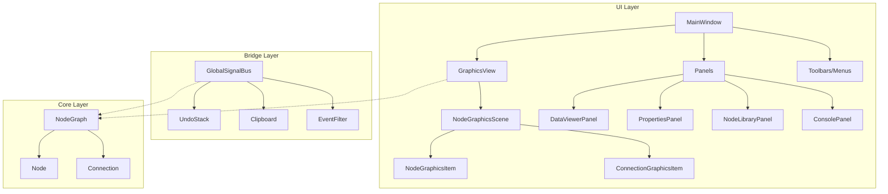
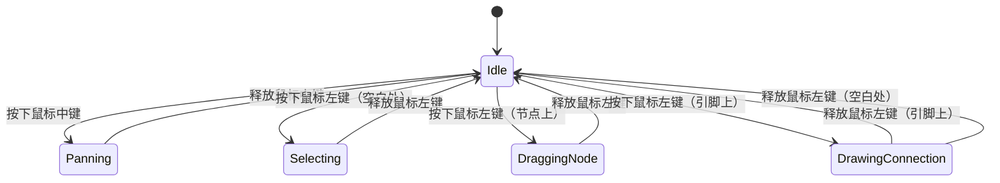
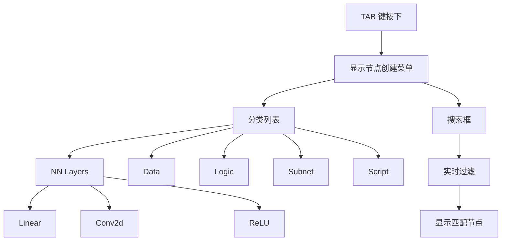
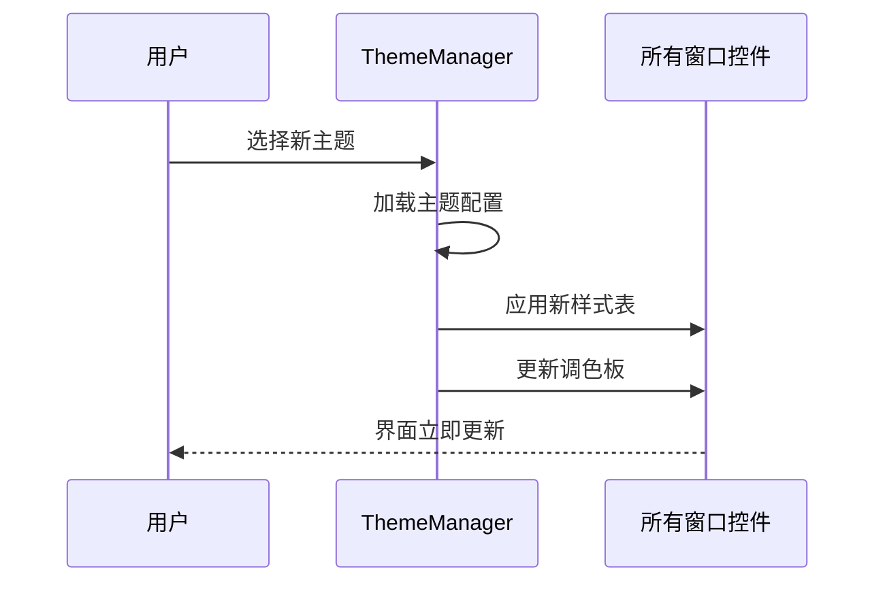

# 04 — UI 框架设计文档

---

## 1. 概述

PNNE 的 UI 框架基于 PyQt6 构建，采用 Model‑View‑Controller（MVC）模式，将核心数据模型（Model）与图形界面（View）分离，通过信号/槽（Signals/Slots）实现双向通信。UI 框架的设计目标是提供流畅、直观、可扩展的可视化节点编辑体验。

### 1.1 设计原则

| 原则 | 说明 |
|------|------|
| **响应式** | 所有用户操作应在 100ms 内得到视觉反馈 |
| **一致性** | 控件风格、交互模式、快捷键在整个应用中保持一致 |
| **可访问性** | 支持键盘导航、屏幕阅读器、高对比度主题 |
| **可扩展性** | 新的面板、控件、主题可以轻松集成 |
| **性能优先** | 大规模节点图（1000+ 节点）仍保持流畅交互 |

### 1.2 UI 架构层次



---

## 2. 主窗口设计

### 2.1 窗口布局

主窗口采用经典的左右分栏布局，左侧为数据可视化面板，右侧为节点图编辑区。

```
┌──────────────────────────────────────────────────────────────┐
│ Menu Bar: File | Edit | Nodes | Training | View | Help       │
├──────────────────────────────────────────────────────────────┤
│ Tool Bar: [▶ Run] [⏹ Stop] | [Select] [Pan] | [Zoom Fit]   │
├──────────────┬───────────────────────────────────────────────┤
│              │                                               │
│   左侧面板    │           右侧 - 节点图编辑区                  │
│   (数据可视化) │                                               │
│              │  ┌─────────────────────────────────────────┐  │
│  ┌─────────┐ │  │  Path: /obj/nnmodel/                    │  │
│  │权重分布  │ │  ├─────────────────────────────────────────┤  │
│  │直方图    │ │  │                                         │  │
│  │         │ │  │    [Conv2d]                              │  │
│  │         │ │  │       │                                  │  │
│  └─────────┘ │  │    [BatchNorm]                           │  │
│              │  │       │                                  │  │
│  ┌─────────┐ │  │    [ReLU]          ┌──────────────┐     │  │
│  │特征图    │ │  │       │           │ 参数面板      │     │  │
│  │可视化    │ │  │    [MaxPool]      │ (右上角浮动)  │     │  │
│  │         │ │  │       │           │              │     │  │
│  │         │ │  │    [Linear]       │ in_features  │     │  │
│  └─────────┘ │  │       │           │ out_features │     │  │
│              │  │    [Softmax]      │ bias         │     │  │
│  ┌─────────┐ │  │                    │ expression   │     │  │
│  │层结构    │ │  │                    └──────────────┘     │  │
│  │链接关系  │ │  │                                         │  │
│  │         │ │  └─────────────────────────────────────────┘  │
│  └─────────┘ │                                               │
│              │                                               │
├──────────────┴───────────────────────────────────────────────┤
│ Status Bar: Ready | Current Path: /obj/nnmodel | GPU: CUDA   │
└──────────────────────────────────────────────────────────────┘
```

### 2.2 菜单栏设计

| 菜单 | 主要功能项 |
|------|------------|
| **File** | New, Open, Save, Save As, Export, Import, Recent Files, Exit |
| **Edit** | Undo, Redo, Cut, Copy, Paste, Delete, Select All, Find Node |
| **Nodes** | Create Node (按类别分组), Group to Subnet, Ungroup, Align, Distribute |
| **Training** | Start Training, Stop Training, Resume, Export Model, Load Checkpoint |
| **View** | Show/Hide Panels, Zoom In/Out, Fit to View, Toggle Theme, Toggle Minimap |
| **Help** | Documentation, Tutorials, About, Check for Updates |

### 2.3 工具栏设计

工具栏提供快速访问常用功能，支持自定义布局。

| 工具栏 | 图标 | 功能 |
|--------|------|------|
| **文件操作** | 📄 New, 📂 Open, 💾 Save | 项目操作 |
| **编辑操作** | ↩️ Undo, ↪️ Redo, ✂️ Cut, 📋 Copy, 📌 Paste | 撤销重做和剪贴板 |
| **视图控制** | 🔍 Zoom In, 🔎 Zoom Out, ⬜ Fit to View, 🖐 Pan | 画布导航 |
| **训练控制** | ▶️ Start Training, ⏹ Stop Training, ⏸ Pause, 📊 Monitor | 训练控制 |
| **节点工具** | ✨ Create Node, 🔗 Connect, 📏 Measure, 🎯 Align | 节点编辑 |

### 2.4 状态栏设计

状态栏显示实时信息：

| 区域 | 内容 | 更新频率 |
|------|------|----------|
| 左侧 | 当前状态（Ready, Executing, Training, Error） | 实时 |
| 中间 | 当前路径（如 `/obj/nnmodel/conv1`） | 路径变化时 |
| 右侧 | 系统信息（GPU 内存使用、CPU 占用、帧率） | 每秒一次 |

---

## 3. 节点图形系统

### 3.1 NodeGraphicsScene

`NodeGraphicsScene` 是 QGraphicsScene 的子类，负责管理所有图形项（节点、连接线、背景网格等）。

**主要职责：**
- 管理图形项的增删改查
- 绘制背景网格和标尺
- 处理图形项的选择和分组
- 坐标转换（场景坐标 ↔ 视图坐标 ↔ 屏幕坐标）

**关键属性：**
```python
class NodeGraphicsScene(QGraphicsScene):
    def __init__(self):
        self.grid_size = 20  # 网格大小（像素）
        self.grid_visible = True
        self.grid_color = QColor(40, 40, 40, 50)
        self.ruler_visible = True
        self.ruler_color = QColor(100, 100, 100, 100)
        self.background_color = QColor(30, 30, 30)  # 深色主题
```

### 3.2 NodeGraphicsView

`NodeGraphicsView` 是 QGraphicsView 的子类，提供画布的视图控件。

**交互功能：**
- **平移**：鼠标中键拖拽或空格键+左键拖拽
- **缩放**：鼠标滚轮或 Ctrl++/Ctrl+-，支持手势缩放
- **框选**：鼠标左键拖拽矩形区域选择多个节点
- **快速导航**：双击节点进入子网，右键拖拽画布

**性能优化：**
- 视口裁剪：只渲染可见区域的图形项
- 细节层次（LOD）：根据缩放级别调整渲染细节
- 异步渲染：复杂图形项在后台线程渲染



### 3.3 NodeGraphicsItem

`NodeGraphicsItem` 是 QGraphicsItem 的子类，表示单个节点的视觉表示。

#### 3.3.1 视觉结构

```
    ◄───── 节点宽度（默认 180px）─────►
    
    ┌───────── 输入引脚区 ─────────┐    ▲
    │  ●input_1    ●input_2        │    │
    ├──────────────────────────────┤    │
    │[⊘]│     [Conv2d]      │[👁]│    │ 节点高度
    │禁用│   图标+名称+选中   │显示│    │（默认 52px）
    │ 1  │      区域 7       │ 1  │    │ + 引脚行高
    ├──────────────────────────────┤    │
    │  ●output_1   ●output_2      │    │
    └──────────────────────────────┘    ▼
```

#### 3.3.2 区域划分

| 区域 | 宽度比例 | 功能 |
|------|----------|------|
| **左侧控制区** | 1/9 | 禁用按钮（点击切换启用/禁用状态） |
| **中央显示区** | 7/9 | 节点图标、名称、选中状态显示 |
| **右侧控制区** | 1/9 | 左侧视图显示按钮（点击在左侧面板显示节点数据） |

#### 3.3.3 状态可视化

| 状态 | 视觉表现 |
|------|----------|
| **正常** | 边框颜色 = 节点类型颜色，背景半透明 |
| **选中** | 边框加粗（3px），发光效果 |
| **禁用** | 整体透明度 50%，禁用按钮显示为 ⊘ |
| **错误** | 边框红色闪烁，显示错误图标 |
| **执行中** | 边框绿色脉冲动画 |
| **悬停** | 边框加亮，显示工具提示（节点摘要） |

#### 3.3.4 自定义绘制

```python
def paint(self, painter, option, widget):
    # 1. 绘制圆角矩形背景
    painter.setBrush(self.background_brush)
    painter.setPen(self.border_pen)
    painter.drawRoundedRect(self.bounding_rect, 5, 5)
    
    # 2. 绘制节点图标和名称
    painter.drawPixmap(self.icon_rect, self.icon_pixmap)
    painter.drawText(self.name_rect, Qt.AlignCenter, self.node_label)
    
    # 3. 绘制引脚
    for pin in self.input_pins:
        pin.paint(painter, option, widget)
    for pin in self.output_pins:
        pin.paint(painter, option, widget)
    
    # 4. 绘制状态指示器
    if self.node.error:
        painter.drawPixmap(self.error_rect, self.error_pixmap)
```

### 3.4 PinGraphicsItem

`PinGraphicsItem` 表示单个引脚的视觉表示。

**视觉设计：**
- 形状：圆形（半径 4px）
- 颜色：根据数据类型着色（TENSOR=蓝色，INT=绿色，FLOAT=橙色）
- 状态：正常、悬停、连接、错误

**交互：**
- 悬停显示工具提示（数据类型、形状、当前值）
- 鼠标按下开始拖拽连接线
- 鼠标释放完成连接

### 3.5 ConnectionGraphicsItem

`ConnectionGraphicsItem` 表示两个引脚之间的连接线。

**视觉设计：**
- 线宽：2px（正常），3px（选中）
- 颜色：根据数据流方向渐变（源引脚颜色 → 目标引脚颜色）
- 样式：实线（正常），虚线（禁用），点线（错误）

**路径计算：**
连接线采用贝塞尔曲线，自动避开中间的节点。

```python
def calculate_path(self):
    # 计算源引脚位置
    source_pos = self.source_pin.scene_pos()
    # 计算目标引脚位置
    target_pos = self.target_pin.scene_pos()
    
    # 计算控制点（使曲线平滑）
    dx = target_pos.x() - source_pos.x()
    control1 = source_pos + QPointF(dx * 0.5, 0)
    control2 = target_pos - QPointF(dx * 0.5, 0)
    
    # 创建贝塞尔曲线路径
    path = QPainterPath(source_pos)
    path.cubicTo(control1, control2, target_pos)
    return path
```

**交互：**
- 悬停高亮，显示数据流信息
- 点击选择连接线
- 双击打开连接属性面板

### 3.6 节点创建菜单

通过 TAB 键或右键菜单快速创建节点。

**设计：**
- 分类树状结构（NN Layers, Data, Logic, Subnet, Script）
- 搜索框实时过滤
- 最近使用节点记录
- 快捷键支持（如输入 "conv" 快速定位到卷积节点）



---

## 4. 面板系统

### 4.1 数据可视化面板（DataViewerPanel）

位于主窗口左侧，用于显示节点数据的各种可视化视图。

**视图类型：**
1. **权重分布直方图**：显示神经网络层的权重分布
2. **特征图可视化**：显示卷积层的输出特征图
3. **梯度热力图**：显示反向传播的梯度幅度
4. **训练曲线**：显示损失和准确率随时间变化
5. **张量查看器**：以表格形式查看张量值

**交互功能：**
- 拖拽调整视图大小
- 切换视图布局（单视图、四视图、自定义网格）
- 导出图像（PNG、SVG）
- 实时更新（训练过程中自动刷新）

### 4.2 参数属性面板（PropertiesPanel）

浮动或停靠在右侧，显示选中节点的可编辑参数。

**控件类型：**
- **整数/浮点数**：滑块 + 数字输入框，可设置范围
- **字符串**：单行/多行文本框，支持正则验证
- **布尔值**：复选框
- **枚举**：下拉选择框
- **颜色**：颜色选择器
- **文件路径**：文件浏览器
- **表达式**：表达式编辑器（支持数学运算和属性引用）

**布局：**
```
┌──────────────────────────┐
│ 节点属性: Conv2d         │
├──────────────────────────┤
│ in_channels      █ 3     │
│ out_channels     █ 64    │
│ kernel_size      █ 3     │
│ stride           █ 1     │
│ padding          █ 1     │
│ dilation         █ 1     │
│ bias             ☑ True  │
│ expression       █ ...   │
└──────────────────────────┘
```

### 4.3 节点库面板（NodeLibraryPanel）

显示所有已注册的节点类型，支持分类浏览和搜索。

**功能：**
- 按类别树状浏览
- 搜索节点（名称、描述、关键字）
- 拖拽创建节点（从库中拖到画布）
- 收藏常用节点
- 查看节点文档（悬停显示）

### 4.4 Detail 数据面板（DetailPanel）

显示当前节点或连接的 Detail 数据（元数据字典）。

**显示格式：**
- 树状视图（可展开/折叠）
- 键值对表格
- JSON 格式化显示
- 支持编辑（可修改的 Detail 项）

### 4.5 Python 控制台面板（ConsolePanel）

内置 Python 交互式控制台，用于调试和脚本编写。

**特性：**
- 语法高亮
- 代码补全（基于当前项目上下文）
- 命令历史
- 多行代码编辑
- 直接访问节点图对象

### 4.6 训练监控面板（TrainingMonitorPanel）

专门用于监控训练过程的面板。

**显示内容：**
- 实时损失曲线、准确率曲线
- 学习率变化曲线
- 梯度统计（均值、方差、最大/最小值）
- 训练速度（样本/秒）
- GPU 内存使用情况

**控制功能：**
- 暂停/继续训练
- 调整学习率
- 保存检查点
- 早停控制

---

## 5. 自定义控件

### 5.1 参数编辑控件集

#### 5.1.1 IntSliderWidget

整数滑块控件，结合滑块和数字输入框。

```python
class IntSliderWidget(QWidget):
    def __init__(self, min_val=0, max_val=100, default=50):
        self.slider = QSlider(Qt.Horizontal)
        self.spinbox = QSpinBox()
        # 双向绑定
        self.slider.valueChanged.connect(self.spinbox.setValue)
        self.spinbox.valueChanged.connect(self.slider.setValue)
```

#### 5.1.2 ExpressionEditorWidget

表达式编辑器，提供语法高亮和自动补全。

**特性：**
- 内置数学函数（sin, cos, exp, log, sqrt）
- 属性引用（如 `@node1.out_channels * 2`）
- 实时语法检查
- 结果预览

#### 5.1.3 TensorShapeWidget

张量形状编辑器，支持动态维度。

**交互：**
- 每个维度可单独编辑
- 支持特殊维度（-1 表示推断）
- 显示形状计算过程

### 5.2 数据可视化控件

#### 5.2.1 HistogramWidget

直方图控件，用于显示权重分布。

```python
class HistogramWidget(QWidget):
    def set_data(self, tensor):
        # 计算直方图
        hist, bins = torch.histogram(tensor.flatten(), bins=50)
        # 使用 PyQtGraph 绘制
        self.plot.clear()
        self.plot.plot(bins[:-1], hist, stepMode=True, fillLevel=0)
```

#### 5.2.2 FeatureMapViewer

特征图可视化控件，显示卷积层的输出。

**显示模式：**
- 网格排列（所有通道）
- 单通道灰度图
- RGB 彩色图（如果是 3 通道）
- 激活热力图

#### 5.2.3 GraphPlotWidget

曲线图控件，用于绘制训练曲线。

**特性：**
- 支持多条曲线同时显示
- 可缩放、平移
- 数据点悬停显示数值
- 导出为 PNG/SVG

### 5.3 代码编辑器控件

基于 QScintilla 的代码编辑器，为 Python 节点提供编辑环境。

**功能：**
- 语法高亮（Python）
- 自动缩进
- 括号匹配
- 代码折叠
- 调试器集成（断点、单步执行）

---

## 6. 主题和样式系统

### 6.1 主题管理器（ThemeManager）

主题管理器负责加载和应用主题配置。

**主题文件格式（JSON）：**
```json
{
  "name": "Dark",
  "colors": {
    "background": "#1e1e1e",
    "foreground": "#d4d4d4",
    "primary": "#007acc",
    "secondary": "#569cd6",
    "success": "#4ec9b0",
    "warning": "#dcdcaa",
    "error": "#f44747"
  },
  "fonts": {
    "default": "Segoe UI, 10pt",
    "monospace": "Consolas, 11pt"
  },
  "metrics": {
    "padding": 6,
    "border_radius": 4
  }
}
```

### 6.2 样式表生成（StyleSheet）

动态生成 QSS（Qt Style Sheets）样式表。

```python
def generate_stylesheet(theme):
    return f"""
    QMainWindow {{
        background-color: {theme.colors.background};
        color: {theme.colors.foreground};
    }}
    
    QPushButton {{
        background-color: {theme.colors.primary};
        border-radius: {theme.metrics.border_radius}px;
        padding: {theme.metrics.padding}px;
    }}
    """
```

### 6.3 内置主题

| 主题 | 描述 | 适用场景 |
|------|------|----------|
| **Dark** | 深色主题，减少视觉疲劳 | 长时间编辑 |
| **Light** | 浅色主题，类似 Visual Studio Code | 演示/截图 |
| **High Contrast** | 高对比度，增强可访问性 | 视力障碍用户 |
| **Color Blind** | 色盲友好配色 | 色盲用户 |

### 6.4 动态主题切换

支持运行时切换主题，无需重启应用。



---

## 7. 交互设计

### 7.1 键盘快捷键

| 快捷键 | 功能 | 上下文 |
|--------|------|--------|
| `Ctrl+N` | 新建项目 | 全局 |
| `Ctrl+O` | 打开项目 | 全局 |
| `Ctrl+S` | 保存项目 | 全局 |
| `Ctrl+Z` / `Ctrl+Y` | 撤销/重做 | 编辑 |
| `Ctrl+C` / `Ctrl+V` | 复制/粘贴 | 编辑 |
| `Delete` | 删除选中节点 | 编辑 |
| `Tab` | 显示节点创建菜单 | 画布 |
| `F2` | 重命名选中节点 | 画布 |
| `F5` | 运行图 | 画布 |
| `Ctrl+F` | 搜索节点 | 全局 |
| `Ctrl+Shift+F` | 在全图中搜索文本 | 全局 |
| `Ctrl+鼠标滚轮` | 缩放画布 | 画布 |
| `空格+拖拽` | 平移画布 | 画布 |

### 7.2 鼠标手势

| 手势 | 功能 |
|------|------|
| 单击节点 | 选择节点 |
| 双击节点 | 进入子网（如果是 SubnetNode） |
| 拖拽节点 | 移动节点 |
| 拖拽引脚 | 创建连接 |
| 右键拖拽 | 平移画布 |
| 滚轮 | 垂直滚动 |
| `Shift+滚轮` | 水平滚动 |
| `Ctrl+滚轮` | 缩放画布 |

### 7.3 触摸屏支持

为触摸屏设备优化：

- **捏合缩放**：双指捏合缩放画布
- **双指平移**：双指拖拽平移画布
- **长按菜单**：长按节点显示上下文菜单
- **轻扫选择**：手指划过多个节点进行框选

### 7.4 拖拽交互

**节点拖拽创建：**
1. 从节点库拖拽节点类型到画布
2. 释放鼠标时创建节点实例

**文件拖拽导入：**
1. 拖拽图像文件到画布 → 创建 ImageLoaderNode
2. 拖拽 JSON 文件到画布 → 导入子图
3. 拖拽 PyTorch 模型文件（.pt）→ 创建 PretrainedModelNode

---

## 8. 无障碍功能

### 8.1 屏幕阅读器支持

所有控件提供适当的可访问性属性：

```python
# 为控件设置可访问性信息
node_item.setAccessibleName("卷积节点")
node_item.setAccessibleDescription("2D 卷积层，输入通道 3，输出通道 64")
node_item.setAccessibleHelp("按 Enter 键进入节点，按空格键切换启用状态")
```

### 8.2 键盘导航

完整的键盘导航支持：

- `Tab` / `Shift+Tab`：在控件间移动焦点
- `Enter`：激活当前控件（如打开节点属性）
- `空格`：切换选中状态（如启用/禁用节点）
- `方向键`：移动选中节点（微调位置）

### 8.3 高对比度模式

专门为视力障碍用户设计的高对比度主题：

- 背景与前景对比度 > 7:1
- 使用纹理区分颜色相近的元素
- 更大的字体和控件尺寸

### 8.4 语音控制（实验性）

通过语音命令控制应用：

```yaml
命令示例:
  - "新建节点 卷积": 创建 Conv2d 节点
  - "运行图": 执行当前图
  - "保存项目": 保存当前项目
  - "显示属性面板": 打开属性面板
```

---

## 9. 性能优化策略

### 9.1 渲染优化

**视口裁剪：**
- 只渲染位于视图范围内的图形项
- 使用 QGraphicsView 的 `setViewportUpdateMode` 优化更新

**细节层次（LOD）：**
- 缩放级别 > 1.0：显示完整节点（图标+名称+引脚）
- 缩放级别 0.3‑1.0：显示简化节点（仅图标+名称）
- 缩放级别 < 0.3：显示节点占位矩形

**异步渲染：**
- 复杂可视化（如特征图）在后台线程渲染
- 使用 QPixmapCache 缓存渲染结果

### 9.2 内存管理

**图形项池：**
- 重用已销毁的图形项，减少内存分配
- 使用弱引用管理图形项生命周期

**纹理压缩：**
- 大尺寸图像使用压缩纹理格式
- 动态加载/卸载纹理，基于最近使用频率（LRU）

### 9.3 响应性保证

**事件队列：**
- 长时间操作（如模型编译）在后台线程执行
- 使用 QThreadPool 管理线程
- 通过信号/槽向 UI 线程发送进度更新

**帧率控制：**
- 限制最大帧率为 60 FPS
- 使用 QTimer 控制渲染频率
- 空闲时降低更新频率

---

## 10. 测试策略

### 10.1 UI 自动化测试

使用 pytest-qt 进行 UI 自动化测试：

```python
def test_node_creation(qtbot):
    # 创建主窗口
    window = MainWindow()
    qtbot.addWidget(window)
    
    # 模拟点击节点创建菜单
    qtbot.keyClick(window, Qt.Key_Tab)
    
    # 搜索卷积节点
    qtbot.keyClicks(window.node_search_dialog.search_box, "conv")
    
    # 选择第一个结果并创建
    qtbot.keyClick(window.node_search_dialog.results_list, Qt.Key_Down)
    qtbot.keyClick(window.node_search_dialog.results_list, Qt.Key_Enter)
    
    # 验证节点已创建
    assert len(window.current_graph.nodes) == 1
```

### 10.2 可视化回归测试

使用图像对比进行可视化回归测试：

```python
def test_node_rendering():
    # 渲染节点到图像
    pixmap = node_item.toPixmap()
    
    # 与基准图像对比
    baseline = QPixmap("baseline_node.png")
    diff = compare_pixmaps(pixmap, baseline)
    
    assert diff < 0.01  # 差异小于 1%
```

### 10.3 性能基准测试

测量关键交互的响应时间：

```python
def benchmark_node_drag():
    start_time = time.perf_counter()
    
    # 模拟拖拽节点 100 次
    for i in range(100):
        drag_node(node, QPointF(i * 10, i * 10))
    
    elapsed = time.perf_counter() - start_time
    assert elapsed < 2.0  # 2 秒内完成 100 次拖拽
```

---

## 11. 附录

### 11.1 UI 组件文件清单

| 文件 | 职责 |
|------|------|
| `ui/main_window.py` | 主窗口框架，菜单/工具栏/状态栏 |
| `ui/graphics/node_graphics_scene.py` | 图形场景，管理图形项 |
| `ui/graphics/node_graphics_view.py` | 图形视图，处理交互 |
| `ui/graphics/node_graphics_item.py` | 节点图形项 |
| `ui/graphics/pin_graphics_item.py` | 引脚图形项 |
| `ui/graphics/connection_graphics_item.py` | 连接线图形项 |
| `ui/panels/data_viewer_panel.py` | 数据可视化面板 |
| `ui/panels/properties_panel.py` | 参数属性面板 |
| `ui/panels/node_library_panel.py` | 节点库面板 |
| `ui/widgets/parameter_widgets.py` | 参数编辑控件集 |
| `ui/widgets/expression_editor.py` | 表达式编辑器 |
| `ui/widgets/code_editor.py` | 代码编辑器 |
| `ui/themes/theme_manager.py` | 主题管理器 |

### 11.2 颜色调色板

| 用途 | 颜色值（深色主题） | 颜色值（浅色主题） |
|------|-------------------|-------------------|
| 背景 | `#1e1e1e` | `#f3f3f3` |
| 前景 | `#d4d4d4` | `#333333` |
| 主色调 | `#007acc` | `#007acc` |
| 成功 | `#4ec9b0` | `#2e7d32` |
| 警告 | `#dcdcaa` | `#f9a825` |
| 错误 | `#f44747` | `#d32f2f` |
| 节点边框 | `#569cd6` | `#1976d2` |
| 连接线 | `#9cdcfe` | `#64b5f6` |

### 11.3 字体规范

| 用途 | 字体 | 大小 | 权重 |
|------|------|------|------|
| 菜单栏 | Segoe UI | 10pt | Normal |
| 工具栏 | Segoe UI | 9pt | Normal |
| 节点名称 | Segoe UI | 10pt | SemiBold |
| 代码编辑器 | Consolas | 11pt | Normal |
| 属性标签 | Segoe UI | 9pt | Normal |
| 属性值 | Segoe UI | 9pt | Normal |

---

*文档版本: v1.0*  
*最后更新: 2026-02-14*  
*文档状态: 已完成*