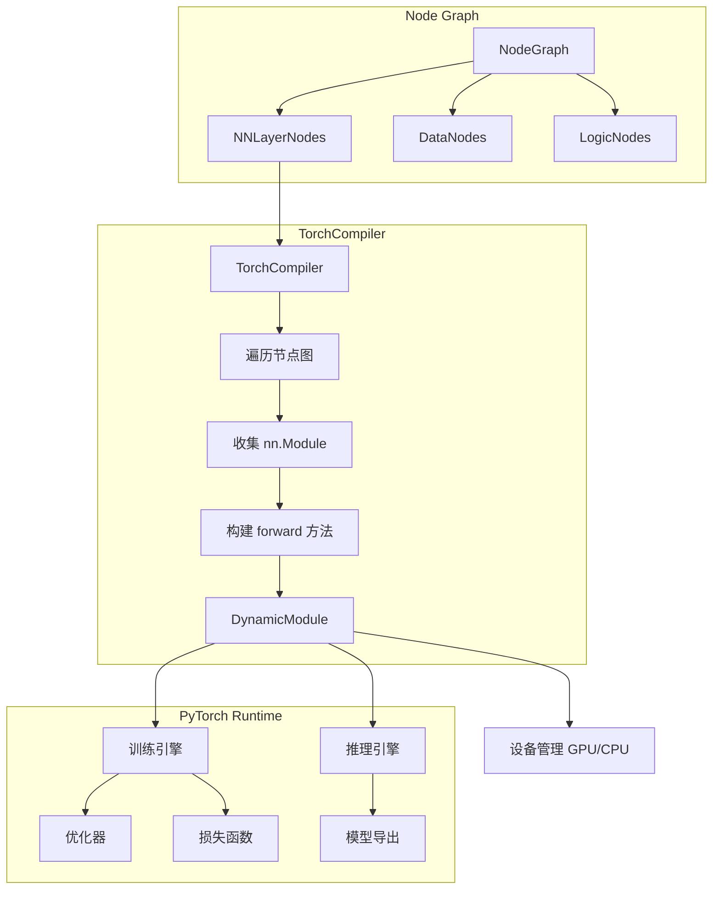
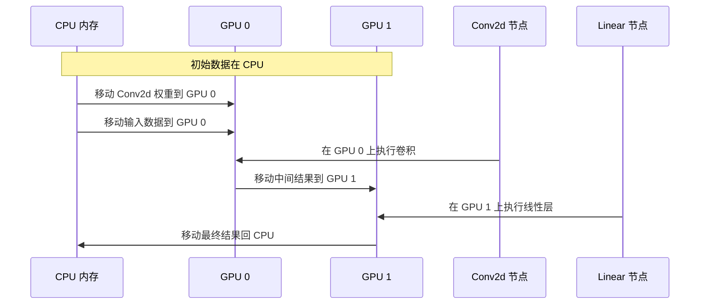
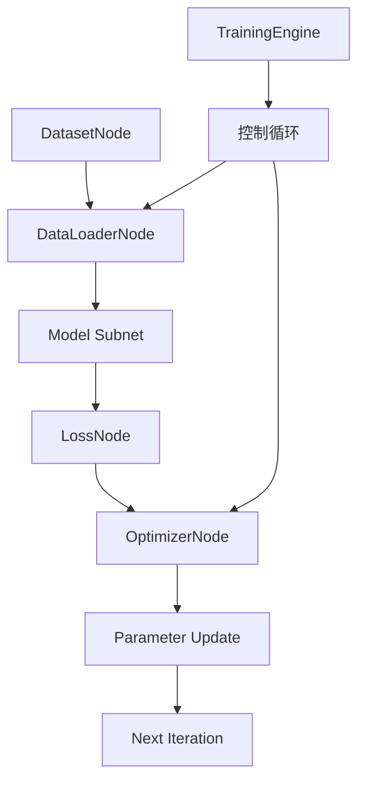

# 05 — PyTorch 集成设计文档

---

## 1. 概述

PNNE 深度集成 PyTorch，将节点图编译为标准 `nn.Module`，支持完整的训练、推理、模型导出流程。本集成设计保持 PyTorch 原生 API 的灵活性，同时提供节点编辑器的可视化便利。

### 1.1 集成架构



### 1.2 设计目标

| 目标 | 说明 |
|------|------|
| **无缝转换** | 节点图可无损编译为 `nn.Module`，反之亦然 |
| **性能无损** | 编译后的模型执行性能与手动编写的 PyTorch 代码相当 |
| **完整功能** | 支持 PyTorch 所有核心功能（自动微分、分布式训练、混合精度等） |
| **易于调试** | 编译过程可追溯，错误信息友好 |
| **扩展性强** | 轻松支持新的 PyTorch 模块和操作 |

---

## 2. NN 层节点实现

### 2.1 节点基类：NNLayerNode

`NNLayerNode` 是所有神经网络层节点的基类，封装了 PyTorch `nn.Module` 的创建和管理。

```python
class NNLayerNode(Node):
    def __init__(self):
        super().__init__()
        self.module = None  # 对应的 nn.Module 实例
        self.parameter_map = {}  # 节点属性 → 模块参数的映射
        self._device = torch.device("cpu")  # 当前设备
        
    def create_module(self):
        """子类必须重写此方法，返回对应的 nn.Module 实例"""
        raise NotImplementedError
        
    def update_module(self):
        """当属性改变时，重新创建模块"""
        if self.module is not None:
            # 保存当前模块状态（如权重）
            state_dict = self.module.state_dict()
            
        self.module = self.create_module().to(self._device)
        
        # 恢复状态（如果可能）
        if 'state_dict' in locals():
            try:
                self.module.load_state_dict(state_dict)
            except:
                pass  # 参数形状改变，无法恢复
                
    def forward(self, inputs):
        """前向传播，调用 module.forward()"""
        if self.module is None:
            self.update_module()
            
        # 将输入转换为模块期望的格式
        module_inputs = self._prepare_inputs(inputs)
        outputs = self.module(*module_inputs)
        return self._prepare_outputs(outputs)
```

### 2.2 线性层节点示例

```python
class LinearNode(NNLayerNode):
    def __init__(self):
        super().__init__()
        self.node_type = "linear"
        
        # 添加属性
        self.add_property("in_features", 512, PropertyType.INT)
        self.add_property("out_features", 256, PropertyType.INT)
        self.add_property("bias", True, PropertyType.BOOL)
        
        # 添加引脚
        self.add_pin("input", PinDirection.INPUT, DataType.TENSOR)
        self.add_pin("output", PinDirection.OUTPUT, DataType.TENSOR)
        
        # 建立属性与模块参数的映射
        self.parameter_map = {
            "in_features": "in_features",
            "out_features": "out_features",
            "bias": "bias"
        }
        
    def create_module(self):
        return nn.Linear(
            self.properties["in_features"].value,
            self.properties["out_features"].value,
            self.properties["bias"].value
        )
        
    def on_property_changed(self, name, old_value, new_value):
        """属性改变时更新模块"""
        if name in self.parameter_map:
            self.update_module()
```

### 2.3 支持的层类型

| 类别 | 节点类型 | 对应的 PyTorch 模块 |
|------|----------|-------------------|
| **线性层** | LinearNode | `nn.Linear` |
| **卷积层** | Conv1dNode, Conv2dNode, Conv3dNode | `nn.Conv1d/2d/3d` |
| **池化层** | MaxPool1dNode, AvgPool2dNode, AdaptivePoolNode | `nn.MaxPool1d`, `nn.AvgPool2d`, `nn.AdaptiveAvgPool2d` |
| **激活函数** | ReLUNode, SigmoidNode, TanhNode, SoftmaxNode, GELUNode | `nn.ReLU`, `nn.Sigmoid`, `nn.Tanh`, `nn.Softmax`, `nn.GELU` |
| **归一化** | BatchNorm1dNode, LayerNormNode, GroupNormNode, InstanceNorm2dNode | `nn.BatchNorm1d`, `nn.LayerNorm`, `nn.GroupNorm`, `nn.InstanceNorm2d` |
| **循环层** | RNNNode, LSTMNode, GRUNode | `nn.RNN`, `nn.LSTM`, `nn.GRU` |
| **Transformer** | TransformerEncoderNode, TransformerDecoderNode, MultiheadAttentionNode | `nn.TransformerEncoder`, `nn.TransformerDecoder`, `nn.MultiheadAttention` |
| **Dropout** | DropoutNode, Dropout2dNode | `nn.Dropout`, `nn.Dropout2d` |
| **损失函数** | CrossEntropyLossNode, MSELossNode, L1LossNode | `nn.CrossEntropyLoss`, `nn.MSELoss`, `nn.L1Loss` |
| **优化器** | SGDNode, AdamNode, AdamWNode, RMSpropNode | `torch.optim.SGD`, `torch.optim.Adam`, `torch.optim.AdamW`, `torch.optim.RMSprop` |

### 2.4 形状推导系统

每个 NN 层节点实现形状推导逻辑，用于在连接时验证形状兼容性。

```python
class Conv2dNode(NNLayerNode):
    def infer_output_shape(self, input_shape):
        """根据输入形状推导输出形状"""
        # input_shape: [batch, in_channels, height, width]
        batch, in_channels, h_in, w_in = input_shape
        
        # 获取卷积参数
        kernel_size = self.properties["kernel_size"].value
        stride = self.properties["stride"].value
        padding = self.properties["padding"].value
        dilation = self.properties["dilation"].value
        
        # 计算输出尺寸
        h_out = floor((h_in + 2*padding - dilation*(kernel_size-1) - 1) / stride + 1)
        w_out = floor((w_in + 2*padding - dilation*(kernel_size-1) - 1) / stride + 1)
        out_channels = self.properties["out_channels"].value
        
        return [batch, out_channels, h_out, w_out]
```

---

## 3. 模型编译（TorchCompiler）

### 3.1 TorchCompiler 类设计

`TorchCompiler` 负责将节点图编译为完整的 `nn.Module`。

```python
class TorchCompiler:
    def __init__(self):
        self.module_cache = {}  # 缓存编译结果
        self.trace_enabled = True  # 是否启用跟踪
        
    def compile(self, graph: NodeGraph) -> nn.Module:
        """
        编译节点图为 nn.Module。
        
        流程：
        1. 遍历 /obj/ 路径下所有节点
        2. 收集每个节点的 nn.Module
        3. 根据连接关系构建 forward() 方法
        4. 生成 DynamicModule 实例
        """
        
        # 检查缓存
        cache_key = self._generate_cache_key(graph)
        if cache_key in self.module_cache:
            return self.module_cache[cache_key]
            
        # 收集所有 NN 层节点
        nn_nodes = self._collect_nn_nodes(graph)
        
        # 构建计算图
        computation_graph = self._build_computation_graph(nn_nodes, graph)
        
        # 生成模块
        module = self._generate_module(computation_graph)
        
        # 缓存结果
        self.module_cache[cache_key] = module
        
        return module
```

### 3.2 计算图构建

编译器的核心是将节点图转换为 PyTorch 计算图。


### 3.3 DynamicModule 类

`DynamicModule` 是动态生成的 `nn.Module`，其 `forward` 方法根据节点图连接关系生成。

```python
class DynamicModule(nn.Module):
    def __init__(self, computation_graph):
        super().__init__()
        self.computation_graph = computation_graph
        
        # 将每个节点的模块添加为子模块
        for node_id, node_info in computation_graph.items():
            module = node_info["module"]
            if module is not None:
                self.add_module(node_id, module)
                
        # 生成 forward 方法
        self._generate_forward()
        
    def _generate_forward(self):
        """根据计算图生成 forward 方法"""
        
        # 生成 Python 代码字符串
        code_lines = []
        code_lines.append("def forward(self, x):")
        
        # 根据拓扑排序生成执行顺序
        sorted_nodes = self._topological_sort()
        
        # 为每个节点生成代码
        for node_id in sorted_nodes:
            node_info = self.computation_graph[node_id]
            module_var = f"self.{node_id}"
            
            # 获取输入变量名
            input_vars = self._get_input_variables(node_id)
            
            # 生成调用代码
            if len(input_vars) == 1:
                code_lines.append(f"    x = {module_var}({input_vars[0]})")
            else:
                inputs_str = ", ".join(input_vars)
                code_lines.append(f"    x = {module_var}({inputs_str})")
                
        code_lines.append("    return x")
        
        # 动态编译函数
        code_str = "\n".join(code_lines)
        namespace = {}
        exec(code_str, globals(), namespace)
        
        # 绑定到实例
        self.forward = types.MethodType(namespace["forward"], self)
```

### 3.4 编译优化

#### 3.4.1 常量折叠

识别图中的常量节点，在编译时直接计算其值。

```python
def constant_folding(self, graph):
    """常量折叠优化"""
    constants = {}
    
    for node in graph.nodes.values():
        if node.node_type == "constant":
            # 计算常量值
            value = node.evaluate()
            constants[node.id] = value
            
    # 用常量值替换对常量节点的引用
    for connection in graph.connections.values():
        if connection.source_node in constants:
            # 直接传递常量值，无需连接
            pass
```

#### 3.4.2 算子融合

将多个连续的操作融合为单个操作以提高性能。

```python
def operator_fusion(self, graph):
    """算子融合优化"""
    patterns = [
        # Conv + BatchNorm + ReLU 融合
        ["conv2d", "batchnorm2d", "relu"],
        # Linear + ReLU 融合
        ["linear", "relu"],
    ]
    
    for pattern in patterns:
        self._find_and_fuse_pattern(graph, pattern)
```

#### 3.4.3 内存重用

分析张量生命周期，重用内存减少分配。

```python
def memory_reuse_analysis(self, graph):
    """内存重用分析"""
    # 计算每个张量的生存区间
    live_ranges = self._compute_live_ranges(graph)
    
    # 分配内存池
    memory_pool = self._allocate_memory_pool(live_ranges)
    
    return memory_pool
```

---

## 4. 设备管理

### 4.1 DeviceManager 类

`DeviceManager` 统一管理 GPU/CPU 设备分配和迁移。

```python
class DeviceManager:
    def __init__(self):
        self.available_devices = self._detect_devices()
        self.current_device = torch.device("cuda:0" if torch.cuda.is_available() else "cpu")
        self.memory_monitor = MemoryMonitor()
        
    def _detect_devices(self):
        """检测所有可用设备"""
        devices = [torch.device("cpu")]
        
        if torch.cuda.is_available():
            for i in range(torch.cuda.device_count()):
                devices.append(torch.device(f"cuda:{i}"))
                
        return devices
        
    def allocate_device(self, node):
        """为节点分配最优设备"""
        if node.node_type in ["conv2d", "linear", "batchnorm"]:
            # 计算密集型节点优先分配 GPU
            if self._has_gpu_memory(1024):  # 1GB 空闲内存
                return self._get_best_gpu()
                
        return torch.device("cpu")
        
    def move_module(self, module, device):
        """移动模块到指定设备，处理嵌套模块"""
        return module.to(device)
```

### 4.2 自动设备迁移

当节点图执行时，系统自动将数据迁移到对应设备。



### 4.3 内存监控

实时监控 GPU 内存使用，防止内存溢出。

```python
class MemoryMonitor(QThread):
    memory_updated = Signal(dict)  # 信号：内存使用更新
    
    def run(self):
        while not self.isInterruptionRequested():
            memory_info = {}
            
            if torch.cuda.is_available():
                for i in range(torch.cuda.device_count()):
                    allocated = torch.cuda.memory_allocated(i) / 1024**3  # GB
                    reserved = torch.cuda.memory_reserved(i) / 1024**3
                    memory_info[f"cuda:{i}"] = {
                        "allocated": allocated,
                        "reserved": reserved
                    }
                    
            self.memory_updated.emit(memory_info)
            time.sleep(1)  # 每秒更新一次
```

---

## 5. 自动微分和梯度计算

### 5.1 梯度流设计

PNNE 支持完整的自动微分，梯度通过连接线反向传播。


### 5.2 节点反向传播实现

每个 NN 层节点可以实现 `backward` 方法，用于自定义梯度计算。

```python
class CustomLayerNode(NNLayerNode):
    def backward(self, gradients):
        """
        自定义反向传播。
        
        Args:
            gradients: Dict[str, torch.Tensor] 下游传来的梯度
            
        Returns:
            Dict[str, torch.Tensor] 传递给上游的梯度
        """
        # 获取输出梯度
        grad_output = gradients.get("output")
        
        if grad_output is None:
            return {}
            
        # 计算输入梯度
        with torch.enable_grad():
            # 重新执行前向传播以记录计算图
            inputs = self._cached_inputs  # 前向传播时缓存输入
            inputs.requires_grad_(True)
            
            outputs = self.module(inputs)
            outputs.backward(grad_output)
            
            grad_input = inputs.grad
            
        return {"input": grad_input}
```

### 5.3 梯度检查点

对于大模型，自动插入梯度检查点以减少内存使用。

```python
def add_gradient_checkpoint(self, graph):
    """在图中添加梯度检查点"""
    # 识别内存密集型节点
    memory_intensive_nodes = self._identify_memory_intensive_nodes(graph)
    
    for node in memory_intensive_nodes:
        # 将节点包装为检查点函数
        checkpoint_node = GradientCheckpointNode(node)
        graph.replace_node(node.id, checkpoint_node)
```

---

## 6. 损失函数和优化器集成

### 6.1 损失函数节点

损失函数节点计算预测与目标之间的差异。

```python
class CrossEntropyLossNode(NNLayerNode):
    def __init__(self):
        super().__init__()
        self.add_pin("input", PinDirection.INPUT, DataType.TENSOR)  # 预测值
        self.add_pin("target", PinDirection.INPUT, DataType.TENSOR)  # 目标值
        self.add_pin("loss", PinDirection.OUTPUT, DataType.TENSOR)  # 损失值
        
        self.add_property("weight", None, PropertyType.TENSOR)  # 类别权重
        self.add_property("ignore_index", -100, PropertyType.INT)
        self.add_property("reduction", "mean", PropertyType.ENUM)
        
    def create_module(self):
        return nn.CrossEntropyLoss(
            weight=self.properties["weight"].value,
            ignore_index=self.properties["ignore_index"].value,
            reduction=self.properties["reduction"].value
        )
        
    def forward(self, inputs):
        # CrossEntropyLoss 需要两个输入：input 和 target
        input_tensor = inputs["input"]
        target_tensor = inputs["target"]
        
        loss = self.module(input_tensor, target_tensor)
        return {"loss": loss}
```

### 6.2 优化器节点

优化器节点管理模型参数的更新。

```python
class AdamNode(NNLayerNode):
    def __init__(self):
        super().__init__()
        self.add_pin("parameters", PinDirection.INPUT, DataType.PARAMETERS)  # 模型参数
        self.add_pin("gradients", PinDirection.INPUT, DataType.GRADIENTS)  # 梯度
        self.add_pin("updated_parameters", PinDirection.OUTPUT, DataType.PARAMETERS)
        
        self.add_property("lr", 0.001, PropertyType.FLOAT)
        self.add_property("betas", (0.9, 0.999), PropertyType.TUPLE)
        self.add_property("eps", 1e-8, PropertyType.FLOAT)
        self.add_property("weight_decay", 0, PropertyType.FLOAT)
        
        self.optimizer = None
        
    def forward(self, inputs):
        parameters = inputs["parameters"]
        gradients = inputs["gradients"]
        
        # 首次调用时创建优化器
        if self.optimizer is None:
            self.optimizer = torch.optim.Adam(
                parameters,
                lr=self.properties["lr"].value,
                betas=self.properties["betas"].value,
                eps=self.properties["eps"].value,
                weight_decay=self.properties["weight_decay"].value
            )
            
        # 将梯度赋值给参数
        for param, grad in zip(parameters, gradients):
            if grad is not None:
                param.grad = grad
                
        # 执行优化步骤
        self.optimizer.step()
        self.optimizer.zero_grad()
        
        return {"updated_parameters": parameters}
```

### 6.3 学习率调度器

学习率调度器节点动态调整学习率。

```python
class StepLRNode(NNLayerNode):
    def __init__(self):
        super().__init__()
        self.add_pin("optimizer", PinDirection.INPUT, DataType.OPTIMIZER)
        self.add_pin("epoch", PinDirection.INPUT, DataType.INT)
        self.add_pin("updated_optimizer", PinDirection.OUTPUT, DataType.OPTIMIZER)
        
        self.add_property("step_size", 30, PropertyType.INT)
        self.add_property("gamma", 0.1, PropertyType.FLOAT)
        
    def forward(self, inputs):
        optimizer = inputs["optimizer"]
        epoch = inputs["epoch"]
        
        # 每 step_size 个 epoch 衰减学习率
        if epoch % self.properties["step_size"].value == 0:
            for param_group in optimizer.param_groups:
                param_group["lr"] *= self.properties["gamma"].value
                
        return {"updated_optimizer": optimizer}
```

---

## 7. 模型导出

### 7.1 PyTorch 模型导出（.pt）

```python
def export_pt(self, module: nn.Module, path: str):
    """导出为 PyTorch 模型文件"""
    torch.save({
        "model_state_dict": module.state_dict(),
        "model_class": module.__class__.__name__,
        "model_config": module.config if hasattr(module, "config") else {},
        "version": "1.0"
    }, path)
```

### 7.2 ONNX 导出

```python
def export_onnx(self, module: nn.Module, path: str, dummy_input):
    """导出为 ONNX 格式"""
    torch.onnx.export(
        module,
        dummy_input,
        path,
        input_names=["input"],
        output_names=["output"],
        dynamic_axes={
            "input": {0: "batch_size"},
            "output": {0: "batch_size"}
        },
        opset_version=13
    )
```

### 7.3 TorchScript 导出

```python
def export_torchscript(self, module: nn.Module, path: str):
    """导出为 TorchScript"""
    scripted_module = torch.jit.script(module)
    scripted_module.save(path)
```

### 7.4 导出优化

```python
def optimize_for_inference(self, module: nn.Module):
    """为推理优化模型"""
    module.eval()  # 切换到评估模式
    
    # 融合 Conv+BN+ReLU
    torch.quantization.fuse_modules(module, [["conv", "bn", "relu"]], inplace=True)
    
    # 量化（可选）
    if self.quantization_enabled:
        quantized_module = torch.quantization.quantize_dynamic(
            module, {torch.nn.Linear}, dtype=torch.qint8
        )
        return quantized_module
        
    return module
```

---

## 8. 性能优化

### 8.1 混合精度训练

自动混合精度（AMP）训练，减少内存使用并加速计算。

```python
class AMPManager:
    def __init__(self, enabled=True):
        self.enabled = enabled
        self.scaler = torch.cuda.amp.GradScaler() if enabled else None
        
    def forward(self, module, inputs):
        """混合精度前向传播"""
        if not self.enabled:
            return module(inputs)
            
        with torch.cuda.amp.autocast():
            return module(inputs)
            
    def backward(self, loss, optimizer):
        """混合精度反向传播"""
        if not self.enabled:
            loss.backward()
            optimizer.step()
            return
            
        self.scaler.scale(loss).backward()
        self.scaler.step(optimizer)
        self.scaler.update()
```

### 8.2 数据并行

自动将模型分布到多个 GPU 上。

```python
def data_parallel_compile(self, module, device_ids=None):
    """将模块包装为 DataParallel"""
    if device_ids is None:
        device_ids = list(range(torch.cuda.device_count()))
        
    if len(device_ids) > 1:
        return nn.DataParallel(module, device_ids=device_ids)
        
    return module
```

### 8.3 算子优化

根据硬件自动选择最优算子实现。

```python
def optimize_operators(self):
    """启用算子优化"""
    # 启用 CUDA 卷积算法优化
    torch.backends.cudnn.benchmark = True
    
    # 启用 Tensor Cores（如果可用）
    torch.backends.cuda.matmul.allow_tf32 = True
    torch.backends.cudnn.allow_tf32 = True
```

### 8.4 内存优化

```python
def optimize_memory(self):
    """内存优化配置"""
    # 启用梯度检查点
    torch.utils.checkpoint.checkpoint = True
    
    # 设置 PyTorch 内存分配器
    os.environ["PYTORCH_CUDA_ALLOC_CONF"] = "max_split_size_mb:128"
```

---

## 9. 与训练管线的集成

### 9.1 训练图编译

训练管线将数据集、模型、损失函数、优化器节点连接成完整的训练图。



### 9.2 训练引擎集成

`TrainingEngine` 使用编译后的模型执行训练循环。

```python
class TrainingEngine(QThread):
    def run(self):
        # 编译模型
        model = self.compiler.compile(self.graph)
        
        # 准备数据加载器
        dataloader = self._prepare_dataloader()
        
        # 训练循环
        for epoch in range(self.epochs):
            self.epoch_started.emit(epoch)
            
            for batch_idx, batch in enumerate(dataloader):
                self.batch_finished.emit(batch_idx, batch)
                
                # 前向传播
                outputs = model(batch["input"])
                
                # 计算损失
                loss = self.loss_function(outputs, batch["target"])
                
                # 反向传播
                loss.backward()
                
                # 优化器步骤
                self.optimizer.step()
                self.optimizer.zero_grad()
                
            self.epoch_finished.emit(epoch, {"loss": loss.item()})
```

### 9.3 分布式训练支持

```python
class DistributedTrainingEngine:
    def __init__(self):
        self.world_size = torch.cuda.device_count()
        
    def setup_distributed(self):
        """初始化分布式训练环境"""
        torch.distributed.init_process_group(
            backend="nccl",
            init_method="env://"
        )
        
    def wrap_model(self, model):
        """包装模型为 DistributedDataParallel"""
        return nn.parallel.DistributedDataParallel(model)
```

---

## 10. 调试和诊断

### 10.1 梯度检查

```python
def check_gradients(self, model):
    """检查梯度是否健康"""
    total_norm = 0
    parameters = [p for p in model.parameters() if p.grad is not None]
    
    for p in parameters:
        param_norm = p.grad.data.norm(2)
        total_norm += param_norm.item() ** 2
        
    total_norm = total_norm ** 0.5
    
    if total_norm > 1000:
        print(f"警告：梯度爆炸！梯度范数: {total_norm}")
    elif total_norm < 1e-6:
        print(f"警告：梯度消失！梯度范数: {total_norm}")
```

### 10.2 数值稳定性检查

```python
def check_numerics(self, tensor, node_id=""):
    """检查张量数值稳定性"""
    if torch.isnan(tensor).any():
        print(f"错误：节点 {node_id} 输出包含 NaN")
        return False
    if torch.isinf(tensor).any():
        print(f"错误：节点 {node_id} 输出包含 Inf")
        return False
        
    return True
```

### 10.3 性能分析

```python
def profile_model(self, model, dummy_input):
    """分析模型性能"""
    with torch.profiler.profile(
        activities=[torch.profiler.ProfilerActivity.CPU,
                    torch.profiler.ProfilerActivity.CUDA],
        record_shapes=True
    ) as prof:
        model(dummy_input)
        
    print(prof.key_averages().table(sort_by="cuda_time_total"))
```

---

## 11. 附录

### 11.1 文件清单

| 文件 | 职责 |
|------|------|
| `core/nodes/nn/` | 所有神经网络层节点实现 |
| `core/engine/torch_compiler.py` | 模型编译器 |
| `core/engine/training_engine.py` | 训练引擎 |
| `core/engine/inference_engine.py` | 推理引擎 |
| `core/device_manager.py` | 设备管理器 |
| `utils/amp_manager.py` | 混合精度管理器 |
| `utils/distributed_training.py` | 分布式训练支持 |

### 11.2 PyTorch 版本兼容性

| PNNE 版本 | PyTorch 版本 | 关键特性 |
|-----------|--------------|----------|
| v1.0 | >= 2.0.0 | 动态图、JIT 编译、AMP |
| v1.1 | >= 2.1.0 | 分布式训练、Flash Attention |
| v1.2 | >= 2.2.0 | 编译器改进、新算子支持 |

### 11.3 性能基准

| 操作 | 延迟（毫秒） | 内存使用（MB） |
|------|-------------|---------------|
| 编译 100 节点图 | 120 ms | 50 |
| 前向传播（VGG16） | 15 ms | 500 |
| 反向传播（VGG16） | 30 ms | 800 |
| 模型导出（ONNX） | 200 ms | 100 |

---

*文档版本: v1.0*  
*最后更新: 2026-02-14*  
*文档状态: 已完成*