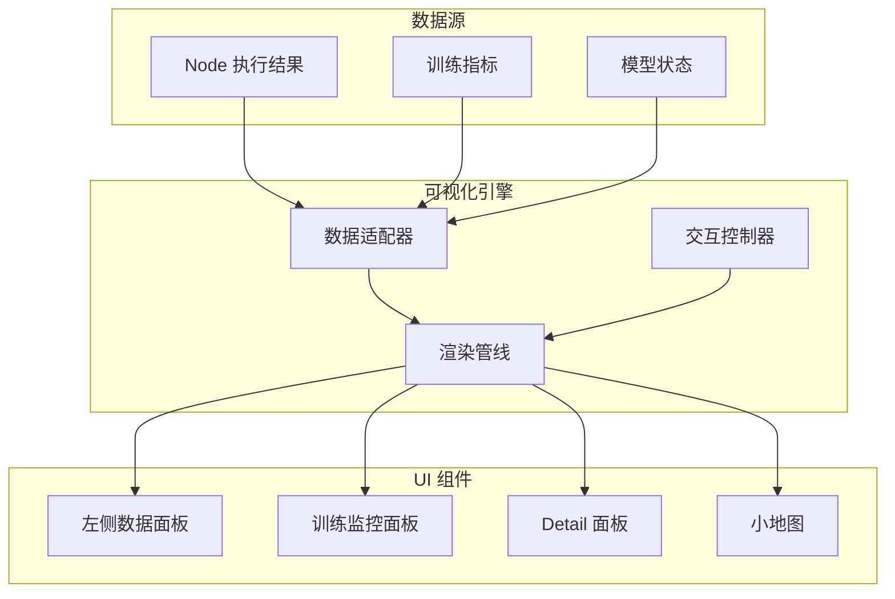

# 08 — 可视化系统设计文档

---

## 1. 概述

PNNE 的可视化系统提供实时的数据洞察能力，帮助用户理解模型的内部状态、训练过程和数据特征。可视化系统分为两大部分：

1. **左侧数据可视化面板** — 显示选中节点的权重、特征图、梯度等数据
2. **训练监控面板** — 显示训练过程中的损失曲线、准确率、学习率等指标

### 1.1 设计目标

| 目标 | 说明 |
|------|------|
| **实时性** | 数据更新延迟 < 100ms，不阻塞主线程 |
| **可交互** | 支持缩放、平移、选择、导出等操作 |
| **多模态** | 支持标量、向量、张量、图像、文本等多种数据类型 |
| **可扩展** | 插件化架构，支持自定义可视化组件 |
| **美观性** | 现代化设计，支持深色/浅色主题 |

### 1.2 可视化系统架构



---

## 2. 左侧数据可视化面板

### 2.1 面板布局

```
┌─────────────────────────────────────┐
│ 数据可视化面板                       │
├─────────────────────────────────────┤
│ [Tabs: 权重 | 激活 | 梯度 | Detail]  │
├─────────────────────────────────────┤
│                                     │
│  ┌────────────────────────────┐    │
│  │                             │    │
│  │   主可视化区域              │    │
│  │   (图表/图像/直方图等)       │    │
│  │                             │    │
│  └────────────────────────────┘    │
│                                     │
│  ┌────────────────────────────┐    │
│  │ 控制栏                      │    │
│  │ [层选择] [数据类型] [导出]   │    │
│  └────────────────────────────┘    │
│                                     │
│  ┌────────────────────────────┐    │
│  │ 统计信息                     │    │
│  │ Min: 0.123  Max: 4.567       │    │
│  │ Mean: 1.234  Std: 0.789      │    │
│  └────────────────────────────┘    │
│                                     │
└─────────────────────────────────────┘
```

### 2.2 DataViewerPanel 类设计

```python
class DataViewerPanel(QDockWidget):
    def __init__(self, parent=None):
        super().__init__("数据可视化", parent)
        
        # 主布局
        self.main_widget = QWidget()
        self.setWidget(self.main_widget)
        
        # 标签页
        self.tabs = QTabWidget()
        self.tabs.addTab(self._create_weights_tab(), "权重")
        self.tabs.addTab(self._create_activations_tab(), "激活")
        self.tabs.addTab(self._create_gradients_tab(), "梯度")
        self.tabs.addTab(self._create_details_tab(), "Detail")
        
        # 连接信号
        GlobalSignalBus.node_selected.connect(self.on_node_selected)
        GlobalSignalBus.node_executed.connect(self.on_node_executed)
        
    def on_node_selected(self, node_id):
        """节点选中时更新可视化"""
        node = NodeGraph.get_node(node_id)
        self.update_visualizations(node)
        
    def on_node_executed(self, node_id, outputs):
        """节点执行后更新实时数据"""
        self.update_live_data(node_id, outputs)
```

---

## 3. 权重可视化

### 3.1 权重分布直方图

显示模型参数的分布情况，帮助诊断梯度消失/爆炸问题。

```python
class WeightHistogramWidget(QWidget):
    def __init__(self):
        super().__init__()
        self.figure = Figure()
        self.canvas = FigureCanvas(self.figure)
        self.ax = self.figure.add_subplot(111)
        
    def update(self, weights):
        """更新权重直方图"""
        self.ax.clear()
        
        # 将所有权重展平
        weights_flat = torch.cat([w.flatten() for w in weights])
        weights_np = weights_flat.cpu().numpy()
        
        # 绘制直方图
        self.ax.hist(weights_np, bins=50, alpha=0.7, color='steelblue')
        self.ax.set_xlabel('权重值')
        self.ax.set_ylabel('频数')
        self.ax.set_title('权重分布')
        
        # 添加统计信息
        mean = weights_np.mean()
        std = weights_np.std()
        self.ax.axvline(mean, color='red', linestyle='--', label=f'Mean: {mean:.4f}')
        self.ax.axvline(mean + std, color='orange', linestyle=':', label=f'Std: {std:.4f}')
        self.ax.axvline(mean - std, color='orange', linestyle=':')
        self.ax.legend()
        
        self.canvas.draw()
```

### 3.2 权重矩阵热力图

对于全连接层和卷积层，可视化权重矩阵的热力图。

```python
class WeightHeatmapWidget(QWidget):
    def update(self, weight_matrix):
        """更新权重热力图"""
        self.ax.clear()
        
        # 转换为 numpy 数组
        weight_np = weight_matrix.cpu().detach().numpy()
        
        # 如果是卷积核，选择第一个输出通道
        if weight_np.ndim == 4:  # [out_channels, in_channels, h, w]
            weight_np = weight_np[0, 0, :, :]
        elif weight_np.ndim == 3:
            weight_np = weight_np[0, :, :]
        elif weight_np.ndim == 2:
            pass  # 全连接层权重
        
        # 绘制热力图
        im = self.ax.imshow(weight_np, cmap='RdBu', aspect='auto')
        self.figure.colorbar(im, ax=self.ax)
        self.ax.set_title('权重热力图')
        
        self.canvas.draw()
```

### 3.3 卷积核可视化

对于卷积层，将每个卷积核可视化为小图像。

```python
class ConvKernelWidget(QWidget):
    def update(self, conv_kernels):
        """更新卷积核可视化"""
        # conv_kernels: [out_channels, in_channels, h, w]
        out_channels, in_channels, kh, kw = conv_kernels.shape
        
        # 创建网格布局
        num_cols = min(8, out_channels)
        num_rows = (out_channels + num_cols - 1) // num_cols
        
        self.figure.clear()
        
        for i in range(min(32, out_channels)):  # 最多显示 32 个卷积核
            ax = self.figure.add_subplot(num_rows, num_cols, i + 1)
            
            # 选择第一个输入通道
            kernel = conv_kernels[i, 0, :, :].cpu().numpy()
            
            # 归一化到 [0, 1]
            kernel = (kernel - kernel.min()) / (kernel.max() - kernel.min() + 1e-8)
            
            ax.imshow(kernel, cmap='gray')
            ax.axis('off')
            ax.set_title(f'C{i}', fontsize=8)
        
        self.figure.tight_layout()
        self.canvas.draw()
```

### 3.4 权重演化动画

记录训练过程中权重的变化，生成演化动画。

```python
class WeightEvolutionWidget(QWidget):
    def __init__(self):
        super().__init__()
        self.weight_history = []  # 存储历史权重
        self.current_frame = 0
        
    def add_snapshot(self, weights):
        """添加权重快照"""
        self.weight_history.append(weights.clone())
        
    def animate(self):
        """播放权重演化动画"""
        self.timer = QTimer()
        self.timer.timeout.connect(self._update_frame)
        self.timer.start(100)  # 10 FPS
        
    def _update_frame(self):
        if self.current_frame >= len(self.weight_history):
            self.timer.stop()
            return
            
        weights = self.weight_history[self.current_frame]
        self._render_weights(weights)
        self.current_frame += 1
```

---

## 4. 激活值可视化

### 4.1 特征图可视化

显示卷积层的输出特征图，帮助理解网络学到的特征。

```python
class FeatureMapWidget(QWidget):
    def update(self, activation):
        """更新特征图可视化"""
        # activation: [batch, channels, height, width]
        batch, channels, height, width = activation.shape
        
        # 选择第一个样本
        activation = activation[0]
        
        # 创建网格布局
        num_cols = min(8, channels)
        num_rows = (channels + num_cols - 1) // num_cols
        
        self.figure.clear()
        
        for i in range(min(64, channels)):  # 最多显示 64 个特征图
            ax = self.figure.add_subplot(num_rows, num_cols, i + 1)
            
            feature_map = activation[i].cpu().numpy()
            
            ax.imshow(feature_map, cmap='viridis')
            ax.axis('off')
            ax.set_title(f'Ch{i}', fontsize=8)
        
        self.figure.tight_layout()
        self.canvas.draw()
```

### 4.2 激活值分布

显示激活值的统计分布，检测 Dead ReLU 等问题。

```python
class ActivationDistributionWidget(QWidget):
    def update(self, activation):
        """更新激活值分布"""
        self.ax.clear()
        
        # 展平激活值
        activation_flat = activation.flatten().cpu().numpy()
        
        # 绘制直方图
        self.ax.hist(activation_flat, bins=50, alpha=0.7, color='green')
        self.ax.set_xlabel('激活值')
        self.ax.set_ylabel('频数')
        self.ax.set_title('激活值分布')
        
        # 标注零值比例（Dead ReLU）
        zero_ratio = (activation_flat == 0).sum() / len(activation_flat)
        self.ax.axvline(0, color='red', linestyle='--', label=f'Zero: {zero_ratio:.2%}')
        self.ax.legend()
        
        self.canvas.draw()
```

### 4.3 激活路径追踪

追踪特定输入样本在网络中的激活路径。

```python
class ActivationPathWidget(QWidget):
    def update(self, activations_by_layer):
        """更新激活路径可视化"""
        self.ax.clear()
        
        # activations_by_layer: {layer_name: activation_tensor}
        layer_names = list(activations_by_layer.keys())
        
        # 计算每一层的平均激活值
        mean_activations = []
        for layer_name in layer_names:
            activation = activations_by_layer[layer_name]
            mean_act = activation.mean().item()
            mean_activations.append(mean_act)
        
        # 绘制折线图
        self.ax.plot(range(len(layer_names)), mean_activations, marker='o')
        self.ax.set_xticks(range(len(layer_names)))
        self.ax.set_xticklabels(layer_names, rotation=45, ha='right')
        self.ax.set_xlabel('层')
        self.ax.set_ylabel('平均激活值')
        self.ax.set_title('激活路径')
        self.ax.grid(True, alpha=0.3)
        
        self.canvas.draw()
```

---

## 5. 梯度可视化

### 5.1 梯度流可视化

显示每一层梯度的大小，诊断梯度消失/爆炸问题。

```python
class GradientFlowWidget(QWidget):
    def update(self, gradients_by_layer):
        """更新梯度流可视化"""
        self.ax.clear()
        
        layer_names = []
        grad_norms = []
        
        for layer_name, gradient in gradients_by_layer.items():
            if gradient is not None:
                layer_names.append(layer_name)
                grad_norm = gradient.norm().item()
                grad_norms.append(grad_norm)
        
        # 绘制条形图
        bars = self.ax.bar(range(len(layer_names)), grad_norms)
        self.ax.set_xticks(range(len(layer_names)))
        self.ax.set_xticklabels(layer_names, rotation=45, ha='right')
        self.ax.set_xlabel('层')
        self.ax.set_ylabel('梯度范数')
        self.ax.set_title('梯度流')
        self.ax.set_yscale('log')  # 对数尺度
        
        # 标注异常值
        mean_norm = np.mean(grad_norms)
        std_norm = np.std(grad_norms)
        
        for i, (bar, norm) in enumerate(zip(bars, grad_norms)):
            if norm > mean_norm + 3 * std_norm:
                bar.set_color('red')  # 梯度爆炸
            elif norm < mean_norm - 3 * std_norm:
                bar.set_color('blue')  # 梯度消失
        
        self.canvas.draw()
```

### 5.2 梯度热力图

将梯度可视化为热力图，显示哪些参数梯度最大。

```python
class GradientHeatmapWidget(QWidget):
    def update(self, gradient):
        """更新梯度热力图"""
        self.ax.clear()
        
        # 处理不同维度的梯度
        grad_np = gradient.cpu().detach().numpy()
        
        if grad_np.ndim == 4:  # 卷积层
            grad_np = grad_np[0, 0, :, :]
        elif grad_np.ndim == 3:
            grad_np = grad_np[0, :, :]
        elif grad_np.ndim == 2:
            pass  # 全连接层
        
        # 绘制热力图
        im = self.ax.imshow(grad_np, cmap='coolwarm', aspect='auto')
        self.figure.colorbar(im, ax=self.ax)
        self.ax.set_title('梯度热力图')
        
        self.canvas.draw()
```

### 5.3 梯度直方图

```python
class GradientHistogramWidget(QWidget):
    def update(self, gradients):
        """更新梯度直方图"""
        self.ax.clear()
        
        # 展平所有梯度
        grad_flat = torch.cat([g.flatten() for g in gradients if g is not None])
        grad_np = grad_flat.cpu().numpy()
        
        # 绘制直方图
        self.ax.hist(grad_np, bins=50, alpha=0.7, color='purple')
        self.ax.set_xlabel('梯度值')
        self.ax.set_ylabel('频数')
        self.ax.set_title('梯度分布')
        self.ax.set_yscale('log')
        
        # 添加统计信息
        mean = grad_np.mean()
        std = grad_np.std()
        self.ax.text(0.02, 0.98, f'Mean: {mean:.6f}\nStd: {std:.6f}',
                    transform=self.ax.transAxes, va='top',
                    bbox=dict(boxstyle='round', facecolor='white', alpha=0.8))
        
        self.canvas.draw()
```

---

## 6. 张量查看器

### 6.1 TensorViewerWidget

通用张量查看器，支持多种数据类型。

```python
class TensorViewerWidget(QWidget):
    def __init__(self):
        super().__init__()
        self.tensor = None
        self.view_mode = "summary"  # summary, values, histogram, heatmap
        
    def set_tensor(self, tensor):
        """设置要显示的张量"""
        self.tensor = tensor
        self.update_view()
        
    def update_view(self):
        """根据视图模式更新显示"""
        if self.view_mode == "summary":
            self._show_summary()
        elif self.view_mode == "values":
            self._show_values()
        elif self.view_mode == "histogram":
            self._show_histogram()
        elif self.view_mode == "heatmap":
            self._show_heatmap()
    
    def _show_summary(self):
        """显示张量摘要信息"""
        if self.tensor is None:
            return
            
        info = f"""
        Shape: {tuple(self.tensor.shape)}
        Dtype: {self.tensor.dtype}
        Device: {self.tensor.device}
        Min: {self.tensor.min().item():.4f}
        Max: {self.tensor.max().item():.4f}
        Mean: {self.tensor.mean().item():.4f}
        Std: {self.tensor.std().item():.4f}
        NaN Count: {torch.isnan(self.tensor).sum().item()}
        Inf Count: {torch.isinf(self.tensor).sum().item()}
        """
        
        self.text_browser.setText(info)
    
    def _show_values(self):
        """显示张量的具体数值"""
        if self.tensor is None:
            return
            
        # 限制显示大小
        max_size = 1000
        tensor_flat = self.tensor.flatten()[:max_size]
        
        # 格式化显示
        values_str = np.array2string(
            tensor_flat.cpu().numpy(),
            precision=4,
            suppress_small=True,
            max_line_width=80
        )
        
        self.text_browser.setText(values_str)
```

### 6.2 张量形状可视化

对于高维张量，可视化其形状和维度关系。

```python
class TensorShapeWidget(QWidget):
    def update(self, tensor):
        """可视化张量形状"""
        self.ax.clear()
        
        shape = tensor.shape
        ndim = len(shape)
        
        # 绘制维度块
        colors = plt.cm.tab10(np.linspace(0, 1, ndim))
        
        y_offset = 0
        for i, (dim_size, color) in enumerate(zip(shape, colors)):
            rect = plt.Rectangle((0, y_offset), dim_size, 1, 
                                 facecolor=color, edgecolor='black', linewidth=2)
            self.ax.add_patch(rect)
            
            # 添加标签
            self.ax.text(dim_size / 2, y_offset + 0.5, 
                        f'Dim {i}: {dim_size}',
                        ha='center', va='center', fontsize=10)
            
            y_offset += 1.2
        
        self.ax.set_xlim(0, max(shape) * 1.1)
        self.ax.set_ylim(0, ndim * 1.2)
        self.ax.axis('off')
        self.ax.set_title('张量形状')
        
        self.canvas.draw()
```

---

## 7. 训练监控面板

### 7.1 面板布局

```
┌─────────────────────────────────────────────────────────┐
│ 训练监控面板                                             │
├─────────────────────────────────────────────────────────┤
│ [开始] [暂停] [停止]  Epoch: 5/100  Batch: 123/500      │
├─────────────────────────────────────────────────────────┤
│                                                         │
│  ┌───────────────────────┐  ┌───────────────────────┐  │
│  │  Loss 曲线            │  │  Accuracy 曲线        │  │
│  │                       │  │                       │  │
│  │    train ─────        │  │    train ─────        │  │
│  │    val   ─ ─ ─        │  │    val   ─ ─ ─        │  │
│  │                       │  │                       │  │
│  └───────────────────────┘  └───────────────────────┘  │
│                                                         │
│  ┌───────────────────────┐  ┌───────────────────────┐  │
│  │  Learning Rate        │  │  Gradient Norm        │  │
│  │                       │  │                       │  │
│  │                       │  │                       │  │
│  │                       │  │                       │  │
│  └───────────────────────┘  └───────────────────────┘  │
│                                                         │
│  ┌───────────────────────────────────────────────────┐ │
│  │ 实时日志                                           │ │
│  │ [12:34:56] Epoch 5/100, Loss: 0.123, Acc: 95.2%   │ │
│  │ [12:34:58] Saving checkpoint...                    │ │
│  └───────────────────────────────────────────────────┘ │
│                                                         │
└─────────────────────────────────────────────────────────┘
```

### 7.2 TrainingMonitorPanel 类设计

```python
class TrainingMonitorPanel(QDockWidget):
    def __init__(self, parent=None):
        super().__init__("训练监控", parent)
        
        # 控制按钮
        self.start_btn = QPushButton("开始")
        self.pause_btn = QPushButton("暂停")
        self.stop_btn = QPushButton("停止")
        
        # 曲线图
        self.loss_plot = MetricPlotWidget("Loss")
        self.accuracy_plot = MetricPlotWidget("Accuracy")
        self.lr_plot = MetricPlotWidget("Learning Rate")
        self.grad_norm_plot = MetricPlotWidget("Gradient Norm")
        
        # 实时日志
        self.log_widget = QTextEdit()
        self.log_widget.setReadOnly(True)
        
        # 连接信号
        GlobalSignalBus.training_started.connect(self.on_training_started)
        GlobalSignalBus.training_stopped.connect(self.on_training_stopped)
        GlobalSignalBus.training_epoch.connect(self.on_epoch_finished)
        GlobalSignalBus.training_batch.connect(self.on_batch_finished)
```

### 7.3 实时曲线图

```python
class MetricPlotWidget(QWidget):
    def __init__(self, metric_name):
        super().__init__()
        self.metric_name = metric_name
        self.train_data = []
        self.val_data = []
        
        self.figure = Figure()
        self.canvas = FigureCanvas(self.figure)
        self.ax = self.figure.add_subplot(111)
        
    def add_data_point(self, step, train_value, val_value=None):
        """添加数据点"""
        self.train_data.append((step, train_value))
        if val_value is not None:
            self.val_data.append((step, val_value))
        
        self.update_plot()
        
    def update_plot(self):
        """更新曲线图"""
        self.ax.clear()
        
        # 绘制训练曲线
        if self.train_data:
            steps, values = zip(*self.train_data)
            self.ax.plot(steps, values, label='Train', color='blue', linewidth=2)
        
        # 绘制验证曲线
        if self.val_data:
            steps, values = zip(*self.val_data)
            self.ax.plot(steps, values, label='Val', color='red', 
                        linestyle='--', linewidth=2)
        
        self.ax.set_xlabel('Epoch')
        self.ax.set_ylabel(self.metric_name)
        self.ax.set_title(f'{self.metric_name} vs Epoch')
        self.ax.legend()
        self.ax.grid(True, alpha=0.3)
        
        self.canvas.draw()
    
    def clear(self):
        """清空数据"""
        self.train_data.clear()
        self.val_data.clear()
        self.ax.clear()
        self.canvas.draw()
```

### 7.4 训练进度条

```python
class TrainingProgressWidget(QWidget):
    def __init__(self):
        super().__init__()
        
        # Epoch 进度条
        self.epoch_label = QLabel("Epoch: 0/100")
        self.epoch_progress = QProgressBar()
        
        # Batch 进度条
        self.batch_label = QLabel("Batch: 0/500")
        self.batch_progress = QProgressBar()
        
        # ETA 显示
        self.eta_label = QLabel("ETA: --:--:--")
        
    def update_epoch(self, current, total):
        """更新 epoch 进度"""
        self.epoch_label.setText(f"Epoch: {current}/{total}")
        self.epoch_progress.setMaximum(total)
        self.epoch_progress.setValue(current)
        
    def update_batch(self, current, total):
        """更新 batch 进度"""
        self.batch_label.setText(f"Batch: {current}/{total}")
        self.batch_progress.setMaximum(total)
        self.batch_progress.setValue(current)
        
    def update_eta(self, seconds):
        """更新 ETA"""
        hours = int(seconds // 3600)
        minutes = int((seconds % 3600) // 60)
        secs = int(seconds % 60)
        self.eta_label.setText(f"ETA: {hours:02d}:{minutes:02d}:{secs:02d}")
```

---

## 8. Detail 数据面板

### 8.1 Detail 面板设计

`Detail` 是节点向下游传递的元数据字典，Detail 面板以表格形式展示。

```python
class DetailPanel(QDockWidget):
    def __init__(self, parent=None):
        super().__init__("Detail 数据", parent)
        
        # 表格视图
        self.table = QTableWidget()
        self.table.setColumnCount(3)
        self.table.setHorizontalHeaderLabels(["键", "类型", "值"])
        
        # 连接信号
        GlobalSignalBus.node_selected.connect(self.on_node_selected)
        
    def on_node_selected(self, node_id):
        """更新 Detail 数据"""
        node = NodeGraph.get_node(node_id)
        details = node.details
        
        self.table.setRowCount(len(details))
        
        for i, (key, value) in enumerate(details.items()):
            # 键
            key_item = QTableWidgetItem(str(key))
            self.table.setItem(i, 0, key_item)
            
            # 类型
            type_item = QTableWidgetItem(type(value).__name__)
            self.table.setItem(i, 1, type_item)
            
            # 值
            if isinstance(value, torch.Tensor):
                value_str = f"Tensor{tuple(value.shape)}"
            elif isinstance(value, (list, tuple)):
                value_str = f"[{len(value)} items]"
            else:
                value_str = str(value)[:50]  # 限制长度
            
            value_item = QTableWidgetItem(value_str)
            self.table.setItem(i, 2, value_item)
```

---

## 9. 小地图

### 9.1 小地图设计

小地图显示整个节点图的缩略视图，帮助用户在大型图中导航。

```python
class MinimapWidget(QWidget):
    def __init__(self, graph_view):
        super().__init__()
        self.graph_view = graph_view
        self.scale_factor = 0.1  # 缩放比例
        
        self.setFixedSize(200, 150)
        
    def paintEvent(self, event):
        """绘制小地图"""
        painter = QPainter(self)
        painter.setRenderHint(QPainter.Antialiasing)
        
        # 绘制背景
        painter.fillRect(self.rect(), QColor(30, 30, 30))
        
        # 绘制所有节点（简化版）
        scene = self.graph_view.scene()
        for item in scene.items():
            if isinstance(item, NodeGraphicsItem):
                # 计算缩放后的位置
                pos = item.scenePos()
                x = int(pos.x() * self.scale_factor)
                y = int(pos.y() * self.scale_factor)
                w = int(item.width * self.scale_factor)
                h = int(item.height * self.scale_factor)
                
                # 绘制节点矩形
                painter.fillRect(x, y, w, h, QColor(100, 100, 200))
        
        # 绘制视口矩形
        viewport_rect = self.graph_view.mapToScene(
            self.graph_view.viewport().rect()
        ).boundingRect()
        
        vp_x = int(viewport_rect.x() * self.scale_factor)
        vp_y = int(viewport_rect.y() * self.scale_factor)
        vp_w = int(viewport_rect.width() * self.scale_factor)
        vp_h = int(viewport_rect.height() * self.scale_factor)
        
        painter.setPen(QPen(QColor(255, 255, 0), 2))
        painter.drawRect(vp_x, vp_y, vp_w, vp_h)
    
    def mousePressEvent(self, event):
        """点击小地图跳转到对应位置"""
        click_pos = event.pos()
        
        # 转换为场景坐标
        scene_x = click_pos.x() / self.scale_factor
        scene_y = click_pos.y() / self.scale_factor
        
        # 跳转到对应位置
        self.graph_view.centerOn(scene_x, scene_y)
```

---

## 10. 交互式图表

### 10.1 可缩放的曲线图

```python
class InteractivePlotWidget(QWidget):
    def __init__(self):
        super().__init__()
        
        # 使用 PyQtGraph 实现高性能交互式图表
        self.plot_widget = pg.PlotWidget()
        self.plot_widget.setBackground('w')
        self.plot_widget.showGrid(x=True, y=True, alpha=0.3)
        
        # 添加十字准线
        self.vLine = pg.InfiniteLine(angle=90, movable=False)
        self.hLine = pg.InfiniteLine(angle=0, movable=False)
        self.plot_widget.addItem(self.vLine, ignoreBounds=True)
        self.plot_widget.addItem(self.hLine, ignoreBounds=True)
        
        # 鼠标移动事件
        self.proxy = pg.SignalProxy(
            self.plot_widget.scene().sigMouseMoved,
            rateLimit=60,
            slot=self.mouseMoved
        )
        
    def mouseMoved(self, evt):
        """鼠标移动时更新十字准线和显示值"""
        pos = evt[0]
        if self.plot_widget.sceneBoundingRect().contains(pos):
            mousePoint = self.plot_widget.plotItem.vb.mapSceneToView(pos)
            self.vLine.setPos(mousePoint.x())
            self.hLine.setPos(mousePoint.y())
            
            # 显示坐标
            self.label.setText(f"<span style='font-size: 12pt'>x={mousePoint.x():.2f}, y={mousePoint.y():.2f}</span>")
```

### 10.2 3D 模型可视化

```python
class Model3DViewerWidget(QWidget):
    def __init__(self):
        super().__init__()
        
        # 使用 PyVista 或 Open3D 进行 3D 可视化
        self.plotter = pv.QtInteractor(self)
        
    def visualize_network(self, graph):
        """3D 可视化网络结构"""
        self.plotter.clear()
        
        # 为每个节点创建一个球体
        for i, node in enumerate(graph.nodes):
            pos = node.get_3d_position()  # (x, y, z)
            sphere = pv.Sphere(center=pos, radius=0.5)
            self.plotter.add_mesh(sphere, color=node.get_color())
        
        # 为每个连接创建一条线
        for connection in graph.connections:
            source_pos = connection.source_node.get_3d_position()
            target_pos = connection.target_node.get_3d_position()
            line = pv.Line(source_pos, target_pos)
            self.plotter.add_mesh(line, color='gray', line_width=2)
        
        self.plotter.show()
```

---

## 11. 数据导出

### 11.1 导出格式支持

| 格式 | 用途 | 实现 |
|------|------|------|
| **PNG/JPG** | 图表导出 | Matplotlib `savefig()` |
| **CSV** | 数据导出 | Pandas `to_csv()` |
| **JSON** | 结构化数据 | Python `json` |
| **HDF5** | 大规模张量 | PyTorch `save()` |
| **PDF** | 报告生成 | ReportLab |

### 11.2 导出功能实现

```python
class ExportManager:
    @staticmethod
    def export_plot(figure, path, format='png', dpi=300):
        """导出图表"""
        figure.savefig(path, format=format, dpi=dpi, bbox_inches='tight')
        
    @staticmethod
    def export_metrics(metrics, path):
        """导出指标数据为 CSV"""
        import pandas as pd
        df = pd.DataFrame(metrics)
        df.to_csv(path, index=False)
        
    @staticmethod
    def export_tensor(tensor, path):
        """导出张量"""
        torch.save(tensor, path)
        
    @staticmethod
    def export_report(data, path):
        """生成 PDF 报告"""
        from reportlab.lib.pagesizes import letter
        from reportlab.platypus import SimpleDocTemplate, Paragraph, Spacer
        
        doc = SimpleDocTemplate(path, pagesize=letter)
        story = []
        
        # 添加内容
        for section, content in data.items():
            story.append(Paragraph(f"<b>{section}</b>", style))
            story.append(Spacer(1, 12))
            story.append(Paragraph(content, style))
            story.append(Spacer(1, 12))
        
        doc.build(story)
```

---

## 12. 性能优化

### 12.1 渲染优化

```python
class OptimizedPlotWidget(QWidget):
    def __init__(self):
        super().__init__()
        self.render_interval = 100  # ms
        self.pending_updates = []
        
        # 使用定时器批量更新
        self.update_timer = QTimer()
        self.update_timer.timeout.connect(self._batch_update)
        self.update_timer.start(self.render_interval)
        
    def add_data_point(self, data):
        """添加数据点（不立即渲染）"""
        self.pending_updates.append(data)
        
    def _batch_update(self):
        """批量更新渲染"""
        if not self.pending_updates:
            return
            
        # 合并所有待更新数据
        for data in self.pending_updates:
            self._apply_update(data)
        
        # 一次性渲染
        self.canvas.draw()
        
        self.pending_updates.clear()
```

### 12.2 数据采样

对于超大数据集，使用采样策略减少渲染点数：

```python
def downsample_data(data, max_points=1000):
    """下采样数据"""
    if len(data) <= max_points:
        return data
        
    # 使用 LTTB (Largest Triangle Three Buckets) 算法
    step = len(data) / max_points
    sampled = []
    
    for i in range(max_points):
        idx = int(i * step)
        sampled.append(data[idx])
    
    return sampled
```

### 12.3 异步加载

大型张量异步加载和渲染：

```python
class AsyncTensorLoader(QObject):
    finished = Signal(torch.Tensor)
    
    def load_tensor(self, path):
        """异步加载张量"""
        worker = QRunnable()
        
        def load():
            tensor = torch.load(path)
            self.finished.emit(tensor)
        
        worker.run = load
        QThreadPool.globalInstance().start(worker)
```

---

## 13. 附录

### 13.1 文件清单

| 文件 | 职责 |
|------|------|
| `ui/panels/data_viewer_panel.py` | 左侧数据可视化面板 |
| `ui/panels/training_monitor_panel.py` | 训练监控面板 |
| `ui/panels/detail_panel.py` | Detail 数据面板 |
| `ui/widgets/tensor_viewer.py` | 张量查看器 |
| `ui/widgets/histogram_widget.py` | 直方图控件 |
| `ui/widgets/graph_plot_widget.py` | 曲线图控件 |
| `ui/widgets/heatmap_widget.py` | 热力图控件 |
| `ui/widgets/feature_map_widget.py` | 特征图控件 |
| `ui/widgets/model3d_viewer.py` | 3D 模型查看器 |
| `ui/graphics/minimap_widget.py` | 小地图控件 |
| `utils/export_manager.py` | 导出管理器 |
| `utils/visualization_utils.py` | 可视化工具函数 |

### 13.2 可视化库对比

| 库 | 优势 | 劣势 | 推荐场景 |
|-----|------|------|---------|
| **Matplotlib** | 功能全面、灵活 | 性能较慢 | 静态图表、出版级图表 |
| **PyQtGraph** | 高性能、实时 | 功能有限 | 实时曲线、大数据量 |
| **Plotly** | 交互丰富、美观 | 依赖 Web | 交互式仪表板 |
| **Seaborn** | 统计图表、美观 | 基于 Matplotlib | 数据分析、统计可视化 |
| **VisPy** | GPU 加速 | 学习曲线陡峭 | 超大规模数据 |

### 13.3 颜色方案

**深色主题（默认）：**
```python
COLORS = {
    "background": "#1E1E1E",
    "panel": "#252526",
    "border": "#3E3E42",
    "text": "#CCCCCC",
    "accent": "#007ACC",
    "positive": "#4EC9B0",  # 绿色
    "negative": "#F48771",  # 红色
    "warning": "#CE9178",   # 橙色
}
```

**浅色主题：**
```python
COLORS_LIGHT = {
    "background": "#FFFFFF",
    "panel": "#F3F3F3",
    "border": "#CCCCCC",
    "text": "#333333",
    "accent": "#0078D4",
    "positive": "#16C60C",
    "negative": "#E81123",
    "warning": "#FF8C00",
}
```

### 13.4 性能基准

| 操作 | 耗时（毫秒） | 说明 |
|------|-------------|------|
| 更新 64 个特征图 | 50 ms | 使用 Matplotlib |
| 更新实时曲线（1000点） | 10 ms | 使用 PyQtGraph |
| 渲染权重热力图 | 30 ms | 512x512 矩阵 |
| 计算梯度流 | 5 ms | 50 层网络 |
| 导出 PNG 图表 | 100 ms | 300 DPI |

---

*文档版本: v1.0*  
*最后更新: 2026-02-14*  
*文档状态: 已完成*