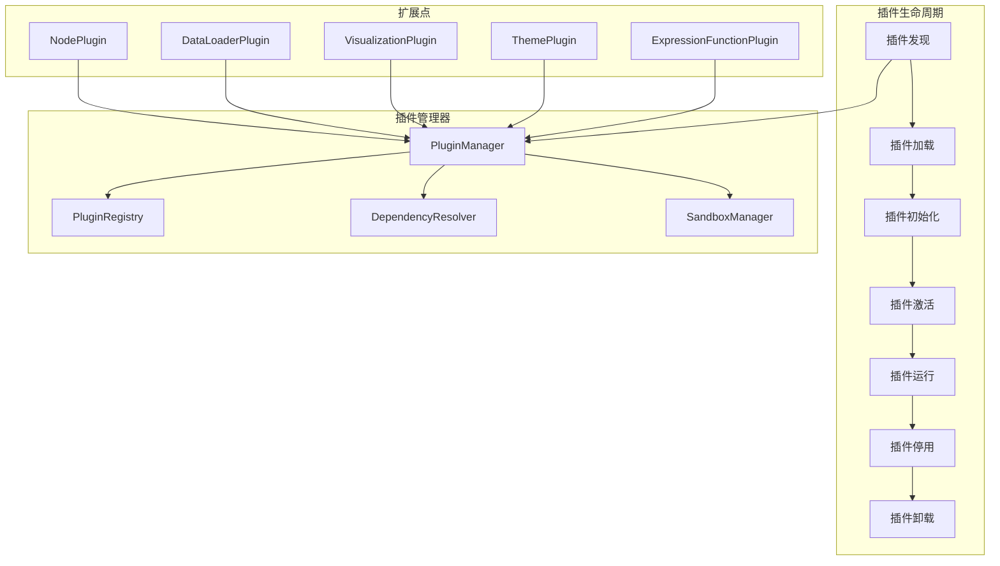

# 09 — 插件系统设计文档

---

## 1. 概述

PNNE 的插件系统提供了一种灵活的扩展机制，允许用户和第三方开发者在不修改核心代码的情况下添加新的节点类型、数据加载器、可视化组件等功能。插件系统采用声明式API和热加载机制，确保良好的开发体验和系统稳定性。

### 1.1 设计目标

| 目标 | 说明 |
|------|------|
| **易用性** | 简洁的API，最小化样板代码 |
| **安全性** | 沙盒隔离，防止恶意代码 |
| **灵活性** | 支持多种类型的扩展点 |
| **可维护性** | 版本管理，依赖解析 |
| **文档化** | 自动生成文档 |

### 1.2 插件系统架构



---

## 2. 插件基类

### 2.1 Plugin 基类

所有插件必须继承自 `Plugin` 基类。

```python
class Plugin(ABC):
    """插件基类"""
    
    # 插件元数据
    name: str = ""
    version: str = "1.0.0"
    author: str = ""
    description: str = ""
    homepage: str = ""
    license: str = "MIT"
    
    # 依赖关系
    requires: List[str] = []  # 依赖的其他插件
    requires_pnne_version: str = ">= 1.0.0"  # 要求的 PNNE 版本
    
    def __init__(self):
        self.enabled = False
        self.config = {}
        self.logger = logging.getLogger(f"Plugin.{self.name}")
        
    @abstractmethod
    def activate(self):
        """激活插件"""
        pass
        
    @abstractmethod
    def deactivate(self):
        """停用插件"""
        pass
        
    def configure(self, config: dict):
        """配置插件"""
        self.config = config
        
    def get_info(self) -> dict:
        """获取插件信息"""
        return {
            "name": self.name,
            "version": self.version,
            "author": self.author,
            "description": self.description,
            "homepage": self.homepage,
            "license": self.license,
            "requires": self.requires,
            "requires_pnne_version": self.requires_pnne_version,
            "enabled": self.enabled
        }
```

### 2.2 插件类型

PNNE 支持以下类型的插件：

| 插件类型 | 基类 | 用途 |
|---------|------|------|
| **节点插件** | `NodePlugin` | 添加自定义节点 |
| **数据加载器插件** | `DataLoaderPlugin` | 支持新的数据格式 |
| **可视化插件** | `VisualizationPlugin` | 自定义可视化组件 |
| **主题插件** | `ThemePlugin` | 自定义UI主题 |
| **表达式函数插件** | `ExpressionFunctionPlugin` | 扩展表达式引擎 |
| **训练策略插件** | `TrainingStrategyPlugin` | 自定义训练算法 |
| **导出插件** | `ExportPlugin` | 支持新的导出格式 |

---

## 3. 节点插件

### 3.1 NodePlugin 类

```python
class NodePlugin(Plugin):
    """节点插件基类"""
    
    @abstractmethod
    def get_node_classes(self) -> List[Type[Node]]:
        """返回要注册的节点类列表"""
        pass
        
    def activate(self):
        """激活插件 —— 注册节点类"""
        node_classes = self.get_node_classes()
        for node_class in node_classes:
            NodeRegistry.register(node_class)
        self.enabled = True
        self.logger.info(f"插件 {self.name} 已激活，注册了 {len(node_classes)} 个节点")
        
    def deactivate(self):
        """停用插件 —— 注销节点类"""
        node_classes = self.get_node_classes()
        for node_class in node_classes:
            NodeRegistry.unregister(node_class)
        self.enabled = False
        self.logger.info(f"插件 {self.name} 已停用")
```

### 3.2 创建节点插件示例

```python
class CustomLayerPlugin(NodePlugin):
    """自定义层插件示例"""
    
    name = "Custom Layer Plugin"
    version = "1.0.0"
    author = "Your Name"
    description = "Adds custom neural network layers"
    
    def get_node_classes(self):
        return [
            GatedLinearUnitNode,
            SwishNode,
            GroupedQueryAttentionNode
        ]

class GatedLinearUnitNode(Node):
    """门控线性单元节点"""
    
    node_type = "nn.GLU"
    category = "Neural Network/Activation"
    
    def __init__(self):
        super().__init__()
        self.node_label = "GLU"
        
        # 定义属性
        self.properties["dim"] = IntProperty(
            name="维度",
            default=-1,
            min=-1,
            description="应用门控的维度"
        )
        
        # 定义引脚
        self.add_pin("input", PinDirection.INPUT, PinDataType.TENSOR)
        self.add_pin("output", PinDirection.OUTPUT, PinDataType.TENSOR)
        
        self._create_module()
        
    def _create_module(self):
        """创建 PyTorch 模块"""
        dim = self.properties["dim"].value
        self.module = nn.GLU(dim=dim)
        
    def forward(self, inputs):
        """前向传播"""
        x = inputs["input"]
        output = self.module(x)
        return {"output": output}
```

---

## 4. 数据加载器插件

### 4.1 DataLoaderPlugin 类

```python
class DataLoaderPlugin(Plugin):
    """数据加载器插件基类"""
    
    @abstractmethod
    def get_supported_formats(self) -> List[str]:
        """返回支持的文件格式列表"""
        pass
        
    @abstractmethod
    def load_data(self, path: str, **kwargs) -> Any:
        """加载数据"""
        pass
        
    def activate(self):
        """激活插件 —— 注册数据加载器"""
        formats = self.get_supported_formats()
        for fmt in formats:
            DataLoaderRegistry.register(fmt, self.load_data)
        self.enabled = True
        
    def deactivate(self):
        """停用插件 —— 注销数据加载器"""
        formats = self.get_supported_formats()
        for fmt in formats:
            DataLoaderRegistry.unregister(fmt)
        self.enabled = False
```

### 4.2 自定义数据加载器示例

```python
class NumpyDataLoaderPlugin(DataLoaderPlugin):
    """NumPy 数据加载器插件"""
    
    name = "NumPy Data Loader"
    version = "1.0.0"
    author = "PNNE Team"
    description = "Load NumPy .npy and .npz files"
    
    def get_supported_formats(self):
        return [".npy", ".npz"]
        
    def load_data(self, path: str, **kwargs):
        """加载 NumPy 数据"""
        if path.endswith(".npy"):
            data = np.load(path)
            return torch.from_numpy(data)
        elif path.endswith(".npz"):
            data = np.load(path)
            # 返回字典
            return {key: torch.from_numpy(arr) for key, arr in data.items()}
        else:
            raise ValueError(f"不支持的格式: {path}")
```

---

## 5. 可视化插件

### 5.1 VisualizationPlugin 类

```python
class VisualizationPlugin(Plugin):
    """可视化插件基类"""
    
    @abstractmethod
    def create_widget(self, parent=None) -> QWidget:
        """创建可视化控件"""
        pass
        
    @abstractmethod
    def update_data(self, data: Any):
        """更新可视化数据"""
        pass
        
    def activate(self):
        """激活插件 —— 注册可视化组件"""
        VisualizationRegistry.register(self.name, self)
        self.enabled = True
        
    def deactivate(self):
        """停用插件 —— 注销可视化组件"""
        VisualizationRegistry.unregister(self.name)
        self.enabled = False
```

### 5.2 自定义可视化插件示例

```python
class ConfusionMatrixPlugin(VisualizationPlugin):
    """混淆矩阵可视化插件"""
    
    name = "Confusion Matrix"
    version = "1.0.0"
    author = "PNNE Team"
    description = "Visualize confusion matrix"
    
    def __init__(self):
        super().__init__()
        self.widget = None
        
    def create_widget(self, parent=None):
        """创建混淆矩阵控件"""
        self.widget = ConfusionMatrixWidget(parent)
        return self.widget
        
    def update_data(self, data):
        """更新混淆矩阵"""
        if self.widget:
            predictions = data["predictions"]
            targets = data["targets"]
            self.widget.update_matrix(predictions, targets)

class ConfusionMatrixWidget(QWidget):
    """混淆矩阵控件"""
    
    def __init__(self, parent=None):
        super().__init__(parent)
        self.figure = Figure()
        self.canvas = FigureCanvas(self.figure)
        self.ax = self.figure.add_subplot(111)
        
    def update_matrix(self, predictions, targets):
        """更新混淆矩阵"""
        from sklearn.metrics import confusion_matrix
        
        cm = confusion_matrix(targets, predictions)
        
        self.ax.clear()
        im = self.ax.imshow(cm, cmap='Blues')
        self.figure.colorbar(im, ax=self.ax)
        
        # 添加数值标签
        for i in range(cm.shape[0]):
            for j in range(cm.shape[1]):
                text = self.ax.text(j, i, cm[i, j],
                                   ha="center", va="center", color="black")
        
        self.ax.set_xlabel('Predicted')
        self.ax.set_ylabel('Actual')
        self.ax.set_title('Confusion Matrix')
        
        self.canvas.draw()
```

---

## 6. 表达式函数插件

### 6.1 ExpressionFunctionPlugin 类

```python
class ExpressionFunctionPlugin(Plugin):
    """表达式函数插件基类"""
    
    @abstractmethod
    def get_functions(self) -> Dict[str, Callable]:
        """返回要注册的函数字典"""
        pass
        
    def activate(self):
        """激活插件 —— 注册表达式函数"""
        functions = self.get_functions()
        for name, func in functions.items():
            ExpressionEngine.register_function(name, func)
        self.enabled = True
        
    def deactivate(self):
        """停用插件 —— 注销表达式函数"""
        functions = self.get_functions()
        for name in functions.keys():
            ExpressionEngine.unregister_function(name)
        self.enabled = False
```

### 6.2 自定义表达式函数示例

```python
class MathExtensionsPlugin(ExpressionFunctionPlugin):
    """数学扩展函数插件"""
    
    name = "Math Extensions"
    version = "1.0.0"
    author = "PNNE Team"
    description = "Additional math functions for expressions"
    
    def get_functions(self):
        return {
            "lerp": self.lerp,
            "smoothstep": self.smoothstep,
            "remap": self.remap
        }
    
    @staticmethod
    def lerp(a, b, t):
        """线性插值"""
        return a + (b - a) * t
    
    @staticmethod
    def smoothstep(edge0, edge1, x):
        """平滑步进"""
        t = np.clip((x - edge0) / (edge1 - edge0), 0.0, 1.0)
        return t * t * (3.0 - 2.0 * t)
    
    @staticmethod
    def remap(value, in_min, in_max, out_min, out_max):
        """重映射值"""
        return out_min + (out_max - out_min) * ((value - in_min) / (in_max - in_min))
```

---

## 7. 插件管理器

### 7.1 PluginManager 类

```python
class PluginManager:
    """插件管理器 —— 单例模式"""
    
    _instance = None
    
    def __new__(cls):
        if cls._instance is None:
            cls._instance = super().__new__(cls)
        return cls._instance
    
    def __init__(self):
        if not hasattr(self, 'initialized'):
            self.plugins: Dict[str, Plugin] = {}
            self.plugin_paths: List[str] = []
            self.enabled_plugins: Set[str] = set()
            self.logger = logging.getLogger("PluginManager")
            self.initialized = True
    
    def add_plugin_path(self, path: str):
        """添加插件搜索路径"""
        if os.path.exists(path) and path not in self.plugin_paths:
            self.plugin_paths.append(path)
            self.logger.info(f"添加插件路径: {path}")
    
    def discover_plugins(self):
        """发现所有插件"""
        discovered = []
        
        for plugin_path in self.plugin_paths:
            for root, dirs, files in os.walk(plugin_path):
                for file in files:
                    if file == "plugin.py":
                        module_path = os.path.join(root, file)
                        plugin = self._load_plugin_module(module_path)
                        if plugin:
                            discovered.append(plugin)
        
        self.logger.info(f"发现 {len(discovered)} 个插件")
        return discovered
    
    def _load_plugin_module(self, module_path: str) -> Optional[Plugin]:
        """加载插件模块"""
        try:
            spec = importlib.util.spec_from_file_location("plugin_module", module_path)
            module = importlib.util.module_from_spec(spec)
            spec.loader.exec_module(module)
            
            # 查找 Plugin 子类
            for name, obj in inspect.getmembers(module):
                if inspect.isclass(obj) and issubclass(obj, Plugin) and obj != Plugin:
                    plugin_instance = obj()
                    self.plugins[plugin_instance.name] = plugin_instance
                    self.logger.info(f"加载插件: {plugin_instance.name} v{plugin_instance.version}")
                    return plugin_instance
        except Exception as e:
            self.logger.error(f"加载插件失败: {module_path}, 错误: {e}")
        
        return None
    
    def enable_plugin(self, plugin_name: str):
        """启用插件"""
        if plugin_name not in self.plugins:
            raise ValueError(f"插件 {plugin_name} 不存在")
        
        plugin = self.plugins[plugin_name]
        
        # 检查依赖
        if not self._check_dependencies(plugin):
            raise RuntimeError(f"插件 {plugin_name} 的依赖未满足")
        
        # 激活插件
        plugin.activate()
        self.enabled_plugins.add(plugin_name)
        self.logger.info(f"启用插件: {plugin_name}")
    
    def disable_plugin(self, plugin_name: str):
        """禁用插件"""
        if plugin_name not in self.plugins:
            raise ValueError(f"插件 {plugin_name} 不存在")
        
        plugin = self.plugins[plugin_name]
        plugin.deactivate()
        self.enabled_plugins.discard(plugin_name)
        self.logger.info(f"禁用插件: {plugin_name}")
    
    def _check_dependencies(self, plugin: Plugin) -> bool:
        """检查插件依赖"""
        for dep in plugin.requires:
            if dep not in self.enabled_plugins:
                self.logger.warning(f"插件 {plugin.name} 依赖 {dep}，但该插件未启用")
                return False
        
        # 检查 PNNE 版本
        pnne_version = get_pnne_version()
        if not self._version_satisfies(pnne_version, plugin.requires_pnne_version):
            self.logger.warning(f"插件 {plugin.name} 要求 PNNE {plugin.requires_pnne_version}，当前版本: {pnne_version}")
            return False
        
        return True
    
    @staticmethod
    def _version_satisfies(current: str, requirement: str) -> bool:
        """检查版本是否满足要求"""
        from packaging import version
        
        ops = {
            "==": lambda a, b: a == b,
            "!=": lambda a, b: a != b,
            ">=": lambda a, b: a >= b,
            "<=": lambda a, b: a <= b,
            ">": lambda a, b: a > b,
            "<": lambda a, b: a < b
        }
        
        for op_str, op_func in ops.items():
            if requirement.startswith(op_str):
                required_ver = requirement[len(op_str):].strip()
                return op_func(version.parse(current), version.parse(required_ver))
        
        return False
    
    def get_all_plugins(self) -> List[Plugin]:
        """获取所有插件"""
        return list(self.plugins.values())
    
    def get_enabled_plugins(self) -> List[Plugin]:
        """获取已启用的插件"""
        return [self.plugins[name] for name in self.enabled_plugins]
```

---

## 8. 插件配置

### 8.1 插件配置文件

每个插件可以有一个配置文件 `plugin.json`：

```json
{
  "name": "Custom Layer Plugin",
  "version": "1.0.0",
  "author": "Your Name",
  "description": "Adds custom neural network layers",
  "homepage": "https://github.com/username/plugin",
  "license": "MIT",
  "entry_point": "plugin.py",
  "requires": [],
  "requires_pnne_version": ">= 1.0.0",
  "settings": {
    "enable_logging": true,
    "log_level": "INFO"
  }
}
```

### 8.2 用户配置

用户可以在 `config/plugins.json` 中配置插件：

```json
{
  "enabled_plugins": [
    "Custom Layer Plugin",
    "NumPy Data Loader",
    "Confusion Matrix"
  ],
  "plugin_paths": [
    "plugins/",
    "C:/Users/username/my_plugins/"
  ],
  "auto_enable": true
}
```

---

## 9. 插件沙盒

### 9.1 安全隔离

为了防止恶意插件，使用沙盒机制限制插件的权限。

```python
class PluginSandbox:
    """插件沙盒"""
    
    def __init__(self):
        self.allowed_modules = {
            "torch", "numpy", "matplotlib", "PIL",
            "PyQt6", "logging", "json", "csv"
        }
        self.forbidden_modules = {
            "os", "sys", "subprocess", "socket",
            "importlib", "__builtin__"
        }
    
    def execute_in_sandbox(self, plugin: Plugin, method_name: str, *args, **kwargs):
        """在沙盒中执行插件方法"""
        # 限制模块导入
        original_import = builtins.__import__
        
        def safe_import(name, *args, **kwargs):
            if name in self.forbidden_modules:
                raise ImportError(f"禁止导入模块: {name}")
            if name.split('.')[0] not in self.allowed_modules:
                raise ImportError(f"不允许导入模块: {name}")
            return original_import(name, *args, **kwargs)
        
        builtins.__import__ = safe_import
        
        try:
            method = getattr(plugin, method_name)
            result = method(*args, **kwargs)
            return result
        finally:
            builtins.__import__ = original_import
```

### 9.2 资源限制

限制插件的 CPU 和内存使用：

```python
class ResourceLimiter:
    """资源限制器"""
    
    @staticmethod
    def limit_memory(max_mb: int):
        """限制内存使用"""
        import resource
        max_bytes = max_mb * 1024 * 1024
        resource.setrlimit(resource.RLIMIT_AS, (max_bytes, max_bytes))
    
    @staticmethod
    def limit_cpu_time(max_seconds: int):
        """限制 CPU 时间"""
        import resource
        resource.setrlimit(resource.RLIMIT_CPU, (max_seconds, max_seconds))
    
    @staticmethod
    def with_timeout(seconds: int):
        """超时装饰器"""
        def decorator(func):
            @wraps(func)
            def wrapper(*args, **kwargs):
                import signal
                
                def timeout_handler(signum, frame):
                    raise TimeoutError(f"函数执行超时 ({seconds}秒)")
                
                signal.signal(signal.SIGALRM, timeout_handler)
                signal.alarm(seconds)
                
                try:
                    result = func(*args, **kwargs)
                finally:
                    signal.alarm(0)
                
                return result
            return wrapper
        return decorator
```

---

## 10. 插件热加载

### 10.1 热加载机制

支持在不重启应用的情况下加载/卸载插件。

```python
class HotReloadManager:
    """热加载管理器"""
    
    def __init__(self, plugin_manager: PluginManager):
        self.plugin_manager = plugin_manager
        self.file_watcher = QFileSystemWatcher()
        
        # 监听插件目录变化
        for path in plugin_manager.plugin_paths:
            self.file_watcher.addPath(path)
        
        self.file_watcher.directoryChanged.connect(self.on_directory_changed)
    
    def on_directory_changed(self, path: str):
        """插件目录变化时触发"""
        self.logger.info(f"检测到插件目录变化: {path}")
        
        # 重新扫描插件
        new_plugins = self.plugin_manager.discover_plugins()
        
        # 自动启用新插件（如果配置允许）
        if Config.get("plugins.auto_enable"):
            for plugin in new_plugins:
                if plugin.name not in self.plugin_manager.enabled_plugins:
                    try:
                        self.plugin_manager.enable_plugin(plugin.name)
                    except Exception as e:
                        self.logger.error(f"自动启用插件失败: {plugin.name}, 错误: {e}")
    
    def reload_plugin(self, plugin_name: str):
        """重新加载插件"""
        # 先禁用
        self.plugin_manager.disable_plugin(plugin_name)
        
        # 重新加载模块
        plugin = self.plugin_manager.plugins[plugin_name]
        importlib.reload(plugin.__class__.__module__)
        
        # 重新启用
        self.plugin_manager.enable_plugin(plugin_name)
```

---

## 11. 插件市场

### 11.1 插件仓库

PNNE 可以连接到在线插件仓库，浏览和安装插件。

```python
class PluginStore:
    """插件商店"""
    
    def __init__(self, repository_url: str):
        self.repository_url = repository_url
        self.cache = {}
    
    def fetch_plugin_list(self) -> List[dict]:
        """获取插件列表"""
        response = requests.get(f"{self.repository_url}/plugins.json")
        return response.json()
    
    def search_plugins(self, query: str) -> List[dict]:
        """搜索插件"""
        plugins = self.fetch_plugin_list()
        results = []
        
        for plugin in plugins:
            if query.lower() in plugin["name"].lower() or \
               query.lower() in plugin["description"].lower():
                results.append(plugin)
        
        return results
    
    def install_plugin(self, plugin_name: str, version: str = "latest"):
        """安装插件"""
        # 下载插件包
        download_url = f"{self.repository_url}/plugins/{plugin_name}/{version}.zip"
        response = requests.get(download_url)
        
        # 解压到插件目录
        plugin_dir = os.path.join("plugins", plugin_name)
        os.makedirs(plugin_dir, exist_ok=True)
        
        with zipfile.ZipFile(io.BytesIO(response.content)) as zip_file:
            zip_file.extractall(plugin_dir)
        
        self.logger.info(f"插件 {plugin_name} 安装成功")
    
    def uninstall_plugin(self, plugin_name: str):
        """卸载插件"""
        plugin_dir = os.path.join("plugins", plugin_name)
        if os.path.exists(plugin_dir):
            shutil.rmtree(plugin_dir)
            self.logger.info(f"插件 {plugin_name} 卸载成功")
```

### 11.2 插件商店 UI

```python
class PluginStoreDialog(QDialog):
    """插件商店对话框"""
    
    def __init__(self, parent=None):
        super().__init__(parent)
        self.setWindowTitle("插件商店")
        self.resize(800, 600)
        
        # 搜索栏
        self.search_bar = QLineEdit()
        self.search_bar.setPlaceholderText("搜索插件...")
        self.search_btn = QPushButton("搜索")
        
        # 插件列表
        self.plugin_list = QListWidget()
        
        # 详情面板
        self.detail_panel = QTextEdit()
        self.detail_panel.setReadOnly(True)
        
        # 按钮
        self.install_btn = QPushButton("安装")
        self.uninstall_btn = QPushButton("卸载")
        
        # 连接信号
        self.search_btn.clicked.connect(self.search_plugins)
        self.plugin_list.currentItemChanged.connect(self.show_plugin_details)
        self.install_btn.clicked.connect(self.install_selected_plugin)
```

---

## 12. 插件开发工具

### 12.1 插件脚手架

提供命令行工具快速创建插件模板：

```bash
pnne-plugin create --name "My Plugin" --type node --author "Your Name"
```

生成的目录结构：

```
my_plugin/
├── plugin.json
├── plugin.py
├── __init__.py
├── nodes/
│   └── my_node.py
├── tests/
│   └── test_my_node.py
├── README.md
└── LICENSE
```

### 12.2 插件开发文档生成

自动生成插件 API 文档：

```python
class PluginDocGenerator:
    """插件文档生成器"""
    
    @staticmethod
    def generate_docs(plugin: Plugin, output_dir: str):
        """生成插件文档"""
        doc = f"""
# {plugin.name}

**Version:** {plugin.version}  
**Author:** {plugin.author}  
**License:** {plugin.license}

## Description

{plugin.description}

## Installation

```bash
pnne-plugin install {plugin.name}
```

## Usage

[此处添加使用说明]

## API Reference

"""
        # 自动提取类和方法文档
        for name, obj in inspect.getmembers(plugin):
            if inspect.ismethod(obj) and not name.startswith('_'):
                doc += f"\n### `{name}`\n\n"
                doc += f"{inspect.getdoc(obj)}\n\n"
        
        # 写入文件
        with open(os.path.join(output_dir, "README.md"), "w") as f:
            f.write(doc)
```

---

## 13. 插件测试

### 13.1 插件单元测试

```python
class PluginTestCase(unittest.TestCase):
    """插件测试基类"""
    
    def setUp(self):
        """设置测试环境"""
        self.plugin_manager = PluginManager()
        self.plugin_manager.add_plugin_path("tests/fixtures/plugins")
        self.plugin_manager.discover_plugins()
    
    def test_plugin_loading(self):
        """测试插件加载"""
        plugins = self.plugin_manager.get_all_plugins()
        self.assertGreater(len(plugins), 0)
    
    def test_plugin_activation(self):
        """测试插件激活"""
        plugin_name = "Test Plugin"
        self.plugin_manager.enable_plugin(plugin_name)
        self.assertIn(plugin_name, self.plugin_manager.enabled_plugins)
    
    def test_plugin_deactivation(self):
        """测试插件停用"""
        plugin_name = "Test Plugin"
        self.plugin_manager.enable_plugin(plugin_name)
        self.plugin_manager.disable_plugin(plugin_name)
        self.assertNotIn(plugin_name, self.plugin_manager.enabled_plugins)
    
    def test_dependency_resolution(self):
        """测试依赖解析"""
        # 测试插件依赖检查
        pass
```

### 13.2 集成测试

```python
class PluginIntegrationTest(unittest.TestCase):
    """插件集成测试"""
    
    def test_node_plugin_integration(self):
        """测试节点插件集成"""
        # 加载节点插件
        plugin_manager = PluginManager()
        plugin_manager.enable_plugin("Custom Layer Plugin")
        
        # 验证节点已注册
        node_class = NodeRegistry.get("nn.GLU")
        self.assertIsNotNone(node_class)
        
        # 创建节点实例
        node = node_class()
        self.assertEqual(node.node_type, "nn.GLU")
        
        # 执行节点
        inputs = {"input": torch.randn(2, 10)}
        outputs = node.forward(inputs)
        self.assertIn("output", outputs)
```

---

## 14. 附录

### 14.1 文件清单

| 文件 | 职责 |
|------|------|
| `plugins/plugin_base.py` | 插件基类定义 |
| `plugins/plugin_manager.py` | 插件管理器 |
| `plugins/plugin_registry.py` | 插件注册表 |
| `plugins/sandbox.py` | 插件沙盒 |
| `plugins/hot_reload.py` | 热加载管理器 |
| `plugins/plugin_store.py` | 插件商店 |
| `ui/dialogs/plugin_store_dialog.py` | 插件商店对话框 |
| `tools/plugin_dev_kit.py` | 插件开发工具 |
| `tests/test_plugin_system.py` | 插件系统测试 |

### 14.2 插件示例列表

| 插件名称 | 类型 | 描述 |
|---------|------|------|
| **Custom Layer Plugin** | 节点 | 添加 GLU、Swish 等自定义层 |
| **NumPy Data Loader** | 数据加载器 | 支持 .npy/.npz 格式 |
| **Confusion Matrix** | 可视化 | 混淆矩阵可视化 |
| **Math Extensions** | 表达式函数 | lerp、smoothstep 等函数 |
| **ResNet Builder** | 节点 | 快速构建 ResNet 架构 |
| **GAN Training** | 训练策略 | 对抗生成网络训练策略 |
| **ONNX Export** | 导出 | 导出为 ONNX 格式 |

### 14.3 插件开发最佳实践

1. **版本管理**: 使用语义化版本号（Semantic Versioning）
2. **文档完整**: 提供详细的 README、API 文档和示例
3. **单元测试**: 为所有公共 API 编写测试
4. **错误处理**: 优雅处理异常，提供有意义的错误信息
5. **性能优化**: 避免阻塞主线程，使用异步操作
6. **国际化**: 支持多语言界面
7. **许可证**: 明确插件的开源许可证
8. **依赖最小化**: 尽量减少外部依赖

### 14.4 插件 API 版本兼容性

| PNNE 版本 | 插件 API 版本 | 兼容性 |
|-----------|--------------|--------|
| 1.0.x | 1.0 | 完全兼容 |
| 1.1.x | 1.0, 1.1 | 向后兼容 |
| 2.0.x | 2.0 | 破坏性变更 |

### 14.5 插件开发示例项目

完整的插件开发示例可在以下仓库找到：
- https://github.com/pnne/plugin-examples
- https://github.com/pnne/plugin-template

---

*文档版本: v1.0*  
*最后更新: 2026-02-14*  
*文档状态: 已完成*