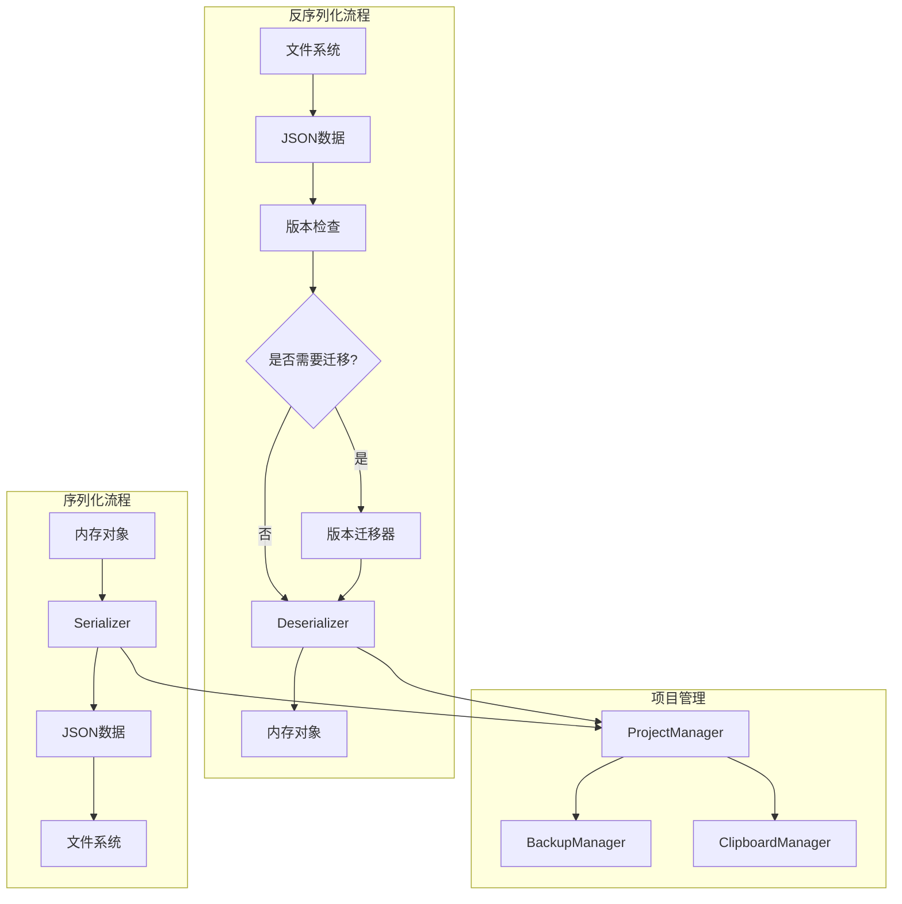

# 10 — 序列化系统设计文档

---

## 1. 概述

PNNE 的序列化系统负责将节点图、项目设置、训练状态等数据持久化到磁盘，并能够从文件中恢复完整的项目状态。系统采用 JSON 格式作为主要序列化格式，支持版本迁移和向后兼容。

### 1.1 设计目标

| 目标 | 说明 |
|------|------|
| **完整性** | 保存所有必要信息，确保项目可完整恢复 |
| **可读性** | 使用人类可读的 JSON 格式 |
| **扩展性** | 支持版本迁移和格式升级 |
| **性能** | 增量保存，避免全量写入 |
| **安全性** | 备份机制，防止数据丢失 |

### 1.2 序列化系统架构



---

## 2. 项目文件格式

### 2.1 项目文件结构

PNNE 项目文件（`.pnne`）是一个 JSON 文件，包含以下部分：

```json
{
  "version": "1.0.0",
  "metadata": {
    "name": "My Project",
    "author": "User Name",
    "created_at": "2026-02-14T10:00:00Z",
    "modified_at": "2026-02-14T12:00:00Z",
    "description": "项目描述",
    "tags": ["classification", "cnn"]
  },
  "settings": {
    "theme": "dark",
    "auto_save": true,
    "auto_save_interval": 300
  },
  "graphs": {
    "/obj/": { ... },
    "/vis/": { ... },
    "/train/": { ... }
  },
  "resources": {
    "datasets": [],
    "checkpoints": []
  }
}
```

### 2.2 节点图序列化格式

```json
{
  "nodes": [
    {
      "id": "uuid-1234",
      "name": "conv1",
      "type": "nn.Conv2d",
      "position": [100, 200],
      "properties": {
        "in_channels": 3,
        "out_channels": 64,
        "kernel_size": 3
      },
      "details": {},
      "enabled": true,
      "visible": true
    }
  ],
  "connections": [
    {
      "id": "conn-5678",
      "source_node": "uuid-1234",
      "source_pin": "output",
      "target_node": "uuid-5678",
      "target_pin": "input",
      "enabled": true
    }
  ],
  "path": "/obj/"
}
```

---

## 3. 序列化器

### 3.1 Serializer 类

```python
class Serializer:
    """序列化器 —— 将对象转换为 JSON"""
    
    @staticmethod
    def serialize_node(node: Node) -> dict:
        """序列化节点"""
        return {
            "id": node.id,
            "name": node.node_name,
            "type": node.node_type,
            "position": [node.position.x(), node.position.y()],
            "properties": Serializer._serialize_properties(node.properties),
            "details": Serializer._serialize_details(node.details),
            "enabled": node.enabled,
            "visible": node.visible
        }
    
    @staticmethod
    def _serialize_properties(properties: Dict[str, Property]) -> dict:
        """序列化属性字典"""
        result = {}
        for key, prop in properties.items():
            result[key] = {
                "type": prop.__class__.__name__,
                "value": prop.value,
                "expression": prop.expression if hasattr(prop, 'expression') else None
            }
        return result
    
    @staticmethod
    def serialize_connection(connection: Connection) -> dict:
        """序列化连接"""
        return {
            "id": connection.id,
            "source_node": connection.source_node.id,
            "source_pin": connection.source_pin.name,
            "target_node": connection.target_node.id,
            "target_pin": connection.target_pin.name,
            "enabled": connection.enabled
        }
    
    @staticmethod
    def serialize_graph(graph: NodeGraph) -> dict:
        """序列化节点图"""
        return {
            "nodes": [Serializer.serialize_node(node) for node in graph.nodes.values()],
            "connections": [Serializer.serialize_connection(conn) for conn in graph.connections],
            "path": graph.path
        }
```

---

## 4. 反序列化器

### 4.1 Deserializer 类

```python
class Deserializer:
    """反序列化器 —— 从 JSON 重建对象"""
    
    @staticmethod
    def deserialize_node(data: dict, node_factory: NodeFactory) -> Node:
        """反序列化节点"""
        # 创建节点实例
        node = node_factory.create(data["type"])
        
        # 恢复基本属性
        node.id = data["id"]
        node.node_name = data["name"]
        node.position = QPointF(data["position"][0], data["position"][1])
        node.enabled = data.get("enabled", True)
        node.visible = data.get("visible", True)
        
        # 恢复属性值
        for key, prop_data in data["properties"].items():
            if key in node.properties:
                node.properties[key].value = prop_data["value"]
                if prop_data.get("expression"):
                    node.properties[key].expression = prop_data["expression"]
        
        # 恢复 details
        node.details = data.get("details", {})
        
        return node
    
    @staticmethod
    def deserialize_connection(data: dict, node_graph: NodeGraph) -> Connection:
        """反序列化连接"""
        source_node = node_graph.nodes[data["source_node"]]
        target_node = node_graph.nodes[data["target_node"]]
        
        source_pin = source_node.pins[data["source_pin"]]
        target_pin = target_node.pins[data["target_pin"]]
        
        connection = Connection(source_pin, target_pin)
        connection.id = data["id"]
        connection.enabled = data.get("enabled", True)
        
        return connection
    
    @staticmethod
    def deserialize_graph(data: dict, node_factory: NodeFactory) -> NodeGraph:
        """反序列化节点图"""
        graph = NodeGraph()
        graph.path = data["path"]
        
        # 先创建所有节点
        for node_data in data["nodes"]:
            node = Deserializer.deserialize_node(node_data, node_factory)
            graph.add_node(node)
        
        # 再创建连接
        for conn_data in data["connections"]:
            connection = Deserializer.deserialize_connection(conn_data, graph)
            graph.add_connection(connection)
        
        return graph
```

---

## 5. 项目管理器

### 5.1 ProjectManager 类

```python
class ProjectManager:
    """项目管理器"""
    
    def __init__(self):
        self.current_project_path = None
        self.is_modified = False
        self.auto_save_enabled = True
        self.auto_save_interval = 300  # 秒
        
        # 自动保存定时器
        self.auto_save_timer = QTimer()
        self.auto_save_timer.timeout.connect(self.auto_save)
        
    def new_project(self, name: str):
        """创建新项目"""
        self.current_project_path = None
        self.is_modified = False
        
        # 初始化空项目
        project_data = {
            "version": FORMAT_VERSION,
            "metadata": {
                "name": name,
                "author": getpass.getuser(),
                "created_at": datetime.now().isoformat(),
                "modified_at": datetime.now().isoformat(),
                "description": "",
                "tags": []
            },
            "settings": {},
            "graphs": {},
            "resources": {}
        }
        
        GlobalSignalBus.project_new.emit()
        return project_data
    
    def save_project(self, path: str, graphs: Dict[str, NodeGraph]):
        """保存项目"""
        project_data = {
            "version": FORMAT_VERSION,
            "metadata": {
                "name": os.path.basename(path).replace(".pnne", ""),
                "modified_at": datetime.now().isoformat()
            },
            "graphs": {}
        }
        
        # 序列化所有节点图
        for path_name, graph in graphs.items():
            project_data["graphs"][path_name] = Serializer.serialize_graph(graph)
        
        # 写入文件
        with open(path, 'w', encoding='utf-8') as f:
            json.dump(project_data, f, indent=2, ensure_ascii=False)
        
        self.current_project_path = path
        self.is_modified = False
        
        GlobalSignalBus.project_saved.emit(path)
        self.logger.info(f"项目已保存: {path}")
    
    def load_project(self, path: str, node_factory: NodeFactory) -> Dict[str, NodeGraph]:
        """加载项目"""
        with open(path, 'r', encoding='utf-8') as f:
            project_data = json.load(f)
        
        # 检查版本
        version = project_data.get("version", "1.0.0")
        if version != FORMAT_VERSION:
            project_data = self._migrate_project(project_data, version)
        
        # 反序列化所有节点图
        graphs = {}
        for path_name, graph_data in project_data["graphs"].items():
            graphs[path_name] = Deserializer.deserialize_graph(graph_data, node_factory)
        
        self.current_project_path = path
        self.is_modified = False
        
        GlobalSignalBus.project_opened.emit(path)
        self.logger.info(f"项目已加载: {path}")
        
        return graphs
    
    def auto_save(self):
        """自动保存"""
        if self.auto_save_enabled and self.is_modified and self.current_project_path:
            backup_path = self.current_project_path + ".autosave"
            self.save_project(backup_path, self.get_current_graphs())
```

---

## 6. 版本迁移

### 6.1 版本迁移器

```python
class VersionMigrator:
    """版本迁移器"""
    
    MIGRATIONS = {
        "1.0.0": "1.1.0",
        "1.1.0": "1.2.0",
        "1.2.0": "2.0.0"
    }
    
    @classmethod
    def migrate(cls, data: dict, from_version: str, to_version: str = FORMAT_VERSION) -> dict:
        """迁移数据到指定版本"""
        current_version = from_version
        
        while current_version != to_version:
            next_version = cls.MIGRATIONS.get(current_version)
            if not next_version:
                raise ValueError(f"无法从 {current_version} 迁移到 {to_version}")
            
            migration_func = getattr(cls, f"_migrate_{current_version.replace('.', '_')}_to_{next_version.replace('.', '_')}")
            data = migration_func(data)
            current_version = next_version
        
        return data
    
    @staticmethod
    def _migrate_1_0_0_to_1_1_0(data: dict) -> dict:
        """从 1.0.0 迁移到 1.1.0"""
        # 添加新字段
        data["metadata"]["tags"] = []
        
        # 迁移节点数据
        for graph_data in data["graphs"].values():
            for node_data in graph_data["nodes"]:
                if "visible" not in node_data:
                    node_data["visible"] = True
        
        data["version"] = "1.1.0"
        return data
```

---

## 7. 剪贴板管理

### 7.1 ClipboardManager 类

```python
class ClipboardManager:
    """剪贴板管理器"""
    
    @staticmethod
    def copy_nodes(nodes: List[Node]):
        """复制节点到剪贴板"""
        data = {
            "type": "pnne_nodes",
            "version": FORMAT_VERSION,
            "nodes": [Serializer.serialize_node(node) for node in nodes],
            "connections": []
        }
        
        # 收集节点间的连接
        node_ids = {node.id for node in nodes}
        for node in nodes:
            for connection in node.get_connections():
                if connection.source_node.id in node_ids and connection.target_node.id in node_ids:
                    data["connections"].append(Serializer.serialize_connection(connection))
        
        # 写入剪贴板
        clipboard = QApplication.clipboard()
        clipboard.setText(json.dumps(data))
    
    @staticmethod
    def paste_nodes(node_factory: NodeFactory) -> List[Node]:
        """从剪贴板粘贴节点"""
        clipboard = QApplication.clipboard()
        text = clipboard.text()
        
        try:
            data = json.loads(text)
            if data.get("type") != "pnne_nodes":
                return []
            
            # 反序列化节点
            nodes = []
            id_mapping = {}  # 旧ID -> 新ID映射
            
            for node_data in data["nodes"]:
                old_id = node_data["id"]
                node = Deserializer.deserialize_node(node_data, node_factory)
                node.id = str(uuid.uuid4())  # 生成新ID
                id_mapping[old_id] = node.id
                nodes.append(node)
            
            return nodes
        except Exception as e:
            logger.error(f"粘贴节点失败: {e}")
            return []
```

---

## 8. 备份管理

### 8.1 BackupManager 类

```python
class BackupManager:
    """备份管理器"""
    
    def __init__(self, backup_dir: str = "backups"):
        self.backup_dir = backup_dir
        os.makedirs(backup_dir, exist_ok=True)
        
    def create_backup(self, project_path: str):
        """创建备份"""
        if not os.path.exists(project_path):
            return
        
        # 生成备份文件名
        timestamp = datetime.now().strftime("%Y%m%d_%H%M%S")
        project_name = os.path.basename(project_path).replace(".pnne", "")
        backup_path = os.path.join(self.backup_dir, f"{project_name}_{timestamp}.pnne")
        
        # 复制文件
        shutil.copy2(project_path, backup_path)
        
        self.logger.info(f"备份已创建: {backup_path}")
        
        # 清理旧备份（保留最近10个）
        self._cleanup_old_backups(project_name, keep=10)
    
    def _cleanup_old_backups(self, project_name: str, keep: int = 10):
        """清理旧备份"""
        backups = []
        for file in os.listdir(self.backup_dir):
            if file.startswith(project_name) and file.endswith(".pnne"):
                full_path = os.path.join(self.backup_dir, file)
                backups.append((full_path, os.path.getmtime(full_path)))
        
        # 按时间排序
        backups.sort(key=lambda x: x[1], reverse=True)
        
        # 删除多余的备份
        for backup_path, _ in backups[keep:]:
            os.remove(backup_path)
            self.logger.info(f"删除旧备份: {backup_path}")
```

---

## 9. 增量保存

### 9.1 IncrementalSaver 类

```python
class IncrementalSaver:
    """增量保存器"""
    
    def __init__(self):
        self.last_saved_state = {}
        
    def compute_diff(self, current_data: dict) -> dict:
        """计算与上次保存的差异"""
        diff = {
            "added_nodes": [],
            "modified_nodes": [],
            "deleted_nodes": [],
            "added_connections": [],
            "deleted_connections": []
        }
        
        # 比较节点
        current_nodes = {node["id"]: node for node in current_data.get("nodes", [])}
        last_nodes = self.last_saved_state.get("nodes", {})
        
        for node_id, node_data in current_nodes.items():
            if node_id not in last_nodes:
                diff["added_nodes"].append(node_data)
            elif node_data != last_nodes[node_id]:
                diff["modified_nodes"].append(node_data)
        
        for node_id in last_nodes:
            if node_id not in current_nodes:
                diff["deleted_nodes"].append(node_id)
        
        return diff
    
    def apply_diff(self, base_data: dict, diff: dict) -> dict:
        """应用差异到基础数据"""
        # 实现差异应用逻辑
        pass
```

---

## 10. 项目模板

### 10.1 模板管理

```python
class TemplateManager:
    """模板管理器"""
    
    def __init__(self, template_dir: str = "templates"):
        self.template_dir = template_dir
        
    def save_as_template(self, project_path: str, template_name: str):
        """将项目保存为模板"""
        template_path = os.path.join(self.template_dir, f"{template_name}.pnne")
        shutil.copy2(project_path, template_path)
        
    def create_from_template(self, template_name: str, output_path: str):
        """从模板创建项目"""
        template_path = os.path.join(self.template_dir, f"{template_name}.pnne")
        shutil.copy2(template_path, output_path)
        
    def list_templates(self) -> List[str]:
        """列出所有模板"""
        templates = []
        for file in os.listdir(self.template_dir):
            if file.endswith(".pnne"):
                templates.append(file.replace(".pnne", ""))
        return templates
```

---

## 11. 附录

### 11.1 文件清单

| 文件 | 职责 |
|------|------|
| `core/serialization/serializer.py` | 序列化器 |
| `core/serialization/deserializer.py` | 反序列化器 |
| `core/serialization/project_manager.py` | 项目管理器 |
| `core/serialization/clipboard.py` | 剪贴板管理 |
| `core/serialization/format_version.py` | 格式版本管理 |
| `core/serialization/backup_manager.py` | 备份管理器 |
| `core/serialization/incremental_save.py` | 增量保存 |
| `core/serialization/template_manager.py` | 模板管理器 |

### 11.2 文件格式版本历史

| 版本 | 发布时间 | 主要变更 |
|------|---------|---------|
| 1.0.0 | 2026-01 | 初始版本 |
| 1.1.0 | 2026-02 | 添加节点可见性属性 |
| 1.2.0 | 2026-03 | 支持子网嵌套 |
| 2.0.0 | 2026-06 | 重构连接数据结构 |

---

*文档版本: v1.0*  
*最后更新: 2026-02-14*  
*文档状态: 已完成*