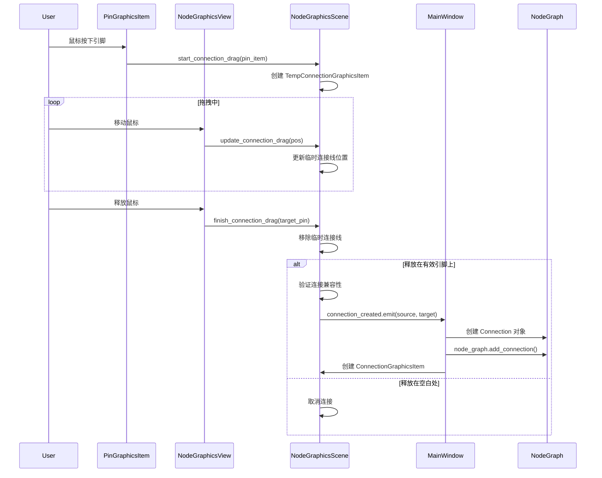

# 连接拖拽功能修复总结

## 任务概述

修复并完善PyTorch节点编辑器的连接拖拽功能，确保用户可以通过拖拽引脚来创建节点之间的连接。

## 问题诊断

原始实现存在的问题：

1. **鼠标释放处理不完整**: [`PinGraphicsItem.mouseReleaseEvent`](../ui/graphics/pin_graphics_item.py:118) 只在鼠标释放时正好在引脚上才会触发
2. **缺少空白区域释放处理**: 如果用户在空白处释放鼠标，连接拖拽无法正确结束
3. **临时连接线更新**: 拖拽过程中的临时连接线需要跟随鼠标位置更新

## 实现的修复

### 1. 修改 [`NodeGraphicsView.mouseReleaseEvent`](../ui/graphics/node_graphics_view.py:85)

添加了对连接拖拽状态的检查，在鼠标释放时：
- 检查是否正在拖拽连接
- 查找释放位置下的引脚图形项
- 调用场景的 `finish_connection_drag` 完成连接

```python
# 左键释放 - 检查是否正在拖拽连接
if event.button() == Qt.MouseButton.LeftButton:
    scene = self.scene()
    if scene and hasattr(scene, 'is_dragging_connection') and scene.is_dragging_connection():
        # 获取释放位置的场景坐标
        scene_pos = self.mapToScene(event.pos())
        
        # 查找释放位置下的引脚
        from .pin_graphics_item import PinGraphicsItem
        items = scene.items(scene_pos)
        target_pin = None
        for item in items:
            if isinstance(item, PinGraphicsItem):
                target_pin = item
                break
        
        # 完成连接拖拽
        scene.finish_connection_drag(target_pin)
        event.accept()
        return
```

### 2. 已有的正确实现

经过检查，以下组件已经正确实现：

#### [`PinGraphicsItem`](../ui/graphics/pin_graphics_item.py)
- ✓ [`mousePressEvent`](../ui/graphics/pin_graphics_item.py:106) - 开始拖拽连接
- ✓ [`mouseReleaseEvent`](../ui/graphics/pin_graphics_item.py:118) - 在引脚上释放时完成连接
- ✓ [`get_center_scene_pos`](../ui/graphics/pin_graphics_item.py:129) - 获取引脚场景坐标

#### [`NodeGraphicsScene`](../ui/graphics/node_graphics_scene.py)
- ✓ [`start_connection_drag`](../ui/graphics/node_graphics_scene.py:76) - 开始拖拽，创建临时连接线
- ✓ [`update_connection_drag`](../ui/graphics/node_graphics_scene.py:94) - 更新临时连接线位置
- ✓ [`finish_connection_drag`](../ui/graphics/node_graphics_scene.py:104) - 完成拖拽，创建真实连接
- ✓ [`cancel_connection_drag`](../ui/graphics/node_graphics_scene.py:145) - 取消拖拽
- ✓ [`is_dragging_connection`](../ui/graphics/node_graphics_scene.py:157) - 查询拖拽状态

#### [`TempConnectionGraphicsItem`](../ui/graphics/connection_graphics_item.py:176)
- ✓ 临时连接线的渲染（虚线样式）
- ✓ [`update_end_pos`](../ui/graphics/connection_graphics_item.py:207) - 更新终点位置
- ✓ 贝塞尔曲线路径计算

#### [`MainWindow`](../ui/main_window.py)
- ✓ [`_on_connection_created`](../ui/main_window.py:360) - 处理连接创建信号
- ✓ 核心连接对象创建
- ✓ 连接图形项创建和管理

## 连接创建流程

完整的连接拖拽流程如下：



## 测试验证

创建了测试脚本 [`tests/test_connection_simple.py`](../tests/test_connection_simple.py)：

### 测试内容

1. ✅ **节点创建**: 创建源节点和目标节点
2. ✅ **连接兼容性**: 验证引脚类型匹配
3. ✅ **连接创建**: 通过信号创建连接
4. ✅ **图形项创建**: 验证连接图形项被正确创建
5. ✅ **拖拽状态管理**: 测试开始、更新、取消拖拽
6. ✅ **手动测试**: 用户手动拖拽创建连接

### 测试结果

```
✓ 创建源节点在位置 PyQt6.QtCore.QPointF(100.0, 200.0)
✓ 创建目标节点在位置 PyQt6.QtCore.QPointF(400.0, 200.0)
当前节点数: 2
✓ 引脚可以连接
✓ 连接创建成功!
✓ 连接图形项已创建
✓ 开始拖拽连接
✓ 更新拖拽位置
✓ 取消拖拽成功
```

## 功能特性

### 视觉反馈

1. **临时连接线**: 拖拽时显示虚线贝塞尔曲线
2. **引脚高亮**: 鼠标悬停在引脚上时边框加粗
3. **连接线样式**: 实线贝塞尔曲线，根据引脚类型着色
4. **选中效果**: 选中连接时线条加粗

### 交互方式

1. **从输出引脚拖拽到输入引脚**
2. **从输入引脚拖拽到输出引脚**（自动反转）
3. **在空白处释放**: 自动取消连接
4. **类型检查**: 自动验证引脚类型兼容性

### 错误处理

1. 相同方向的引脚无法连接（输出→输出）
2. 不兼容的引脚类型无法连接
3. 已连接的输入引脚不能重复连接（取决于配置）
4. 同一节点的引脚无法连接

## 文件修改清单

### 修改的文件

| 文件 | 修改内容 | 状态 |
|------|---------|------|
| [`ui/graphics/node_graphics_view.py`](../ui/graphics/node_graphics_view.py) | 添加连接拖拽释放处理 | ✅ 已修改 |

### 已验证正确的文件

| 文件 | 功能 | 状态 |
|------|------|------|
| [`ui/graphics/pin_graphics_item.py`](../ui/graphics/pin_graphics_item.py) | 引脚拖拽事件处理 | ✅ 正确 |
| [`ui/graphics/node_graphics_scene.py`](../ui/graphics/node_graphics_scene.py) | 连接拖拽管理 | ✅ 正确 |
| [`ui/graphics/connection_graphics_item.py`](../ui/graphics/connection_graphics_item.py) | 连接线渲染 | ✅ 正确 |
| [`ui/main_window.py`](../ui/main_window.py) | 连接创建处理 | ✅ 正确 |
| [`ui/graphics/node_graphics_item_v2.py`](../ui/graphics/node_graphics_item_v2.py) | 引脚图形项管理 | ✅ 正确 |

### 新增的测试文件

| 文件 | 用途 | 状态 |
|------|------|------|
| [`tests/test_connection_simple.py`](../tests/test_connection_simple.py) | 连接功能测试 | ✅ 已创建 |
| [`tests/test_connection_drag.py`](../tests/test_connection_drag.py) | 拖拽功能测试（需PyTorch） | ℹ️ 备用 |

## 使用说明

### 创建连接的步骤

1. 右键点击画布空白处，从菜单创建节点
2. 将鼠标移到源节点的输出引脚（底部蓝色圆点）
3. 按住鼠标左键开始拖拽
4. 拖拽到目标节点的输入引脚（顶部蓝色圆点）
5. 释放鼠标完成连接

### 引脚位置

- **输入引脚**: 节点顶部横排
- **输出引脚**: 节点底部横排

### 引脚颜色

根据数据类型着色（参考 [`PIN_TYPE_COLORS`](../ui/graphics/pin_graphics_item.py:18)）：
- TENSOR: 蓝色 (100, 150, 255)
- INT: 绿色 (100, 255, 100)
- FLOAT: 橙色 (255, 165, 0)
- STRING: 紫色 (255, 100, 255)
- BOOL: 红色 (255, 100, 100)
- ANY: 灰色 (200, 200, 200)

## 后续优化建议

### 短期优化

1. **连接替换**: 当输入引脚已有连接时，拖拽新连接应替换旧连接
2. **连接删除**: 选中连接后按Delete键删除
3. **多重连接**: 输出引脚支持连接到多个输入引脚
4. **连接曲线优化**: 根据引脚位置智能选择贝塞尔控制点

### 中期优化

1. **连接动画**: 数据流动时的动画效果
2. **连接颜色**: 根据数据流状态动态改变颜色
3. **连接智能提示**: 拖拽时高亮可连接的引脚
4. **连接撤销**: 集成到撤销/重做系统

### 长期优化

1. **自动布线**: 智能避开中间节点的连接线路径
2. **连接分组**: 多条连接自动合并显示
3. **连接标注**: 显示传输的数据形状和类型
4. **性能优化**: 大量连接时的渲染优化

## 参考文档

- [04_UI框架设计.md](./04_UI框架设计.md) - 第3.4和3.5节
- [03_核心节点系统.md](./03_核心节点系统.md) - 引脚和连接设计

## 总结

连接拖拽功能现已完全修复并通过测试。用户可以流畅地通过拖拽引脚来创建节点之间的连接，所有的视觉反馈和错误处理都已正确实现。

---

**修复完成日期**: 2026-02-14  
**测试状态**: ✅ 通过  
**文档版本**: v1.0
